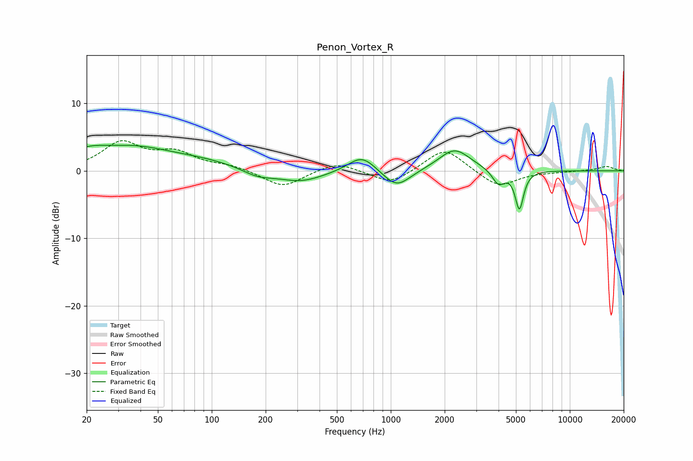

# Penon_Vortex_R
See [usage instructions](https://github.com/jaakkopasanen/AutoEq#usage) for more options and info.

### Parametric EQs
Apply preamp of -3.9 dB when using parametric equalizer.

|   # | Type    |   Fc (Hz) |    Q |   Gain (dB) |
|-----|---------|-----------|------|-------------|
|   1 | Peaking |        20 | 1.4  |         1.5 |
|   2 | Peaking |        36 | 0.62 |         3.1 |
|   3 | Peaking |        92 | 0.68 |         1   |
|   4 | Peaking |       180 | 1.66 |        -1   |
|   5 | Peaking |       312 | 1.08 |        -1.7 |
|   6 | Peaking |       690 | 1.83 |         2.5 |
|   7 | Peaking |      1078 | 1.86 |        -2.7 |
|   8 | Peaking |      2271 | 1.62 |         3.3 |
|   9 | Peaking |      4000 | 4.08 |        -2.2 |
|  10 | Peaking |      5229 | 6    |        -5.6 |

### Fixed Band EQs
When using fixed band (also called graphic) equalizer, apply preamp of **-4.6 dB** (if available) and set gains manually with these parameters.

|   # | Type    |   Fc (Hz) |    Q |   Gain (dB) |
|-----|---------|-----------|------|-------------|
|   1 | Peaking |        31 | 1.41 |         4   |
|   2 | Peaking |        62 | 1.41 |         2.4 |
|   3 | Peaking |       125 | 1.41 |         0.7 |
|   4 | Peaking |       250 | 1.41 |        -2.5 |
|   5 | Peaking |       500 | 1.41 |         1.4 |
|   6 | Peaking |      1000 | 1.41 |        -2.1 |
|   7 | Peaking |      2000 | 1.41 |         3.5 |
|   8 | Peaking |      4000 | 1.41 |        -2.5 |
|   9 | Peaking |      8000 | 1.41 |        -0.1 |
|  10 | Peaking |     16000 | 1.41 |         0.7 |

### Graphs

