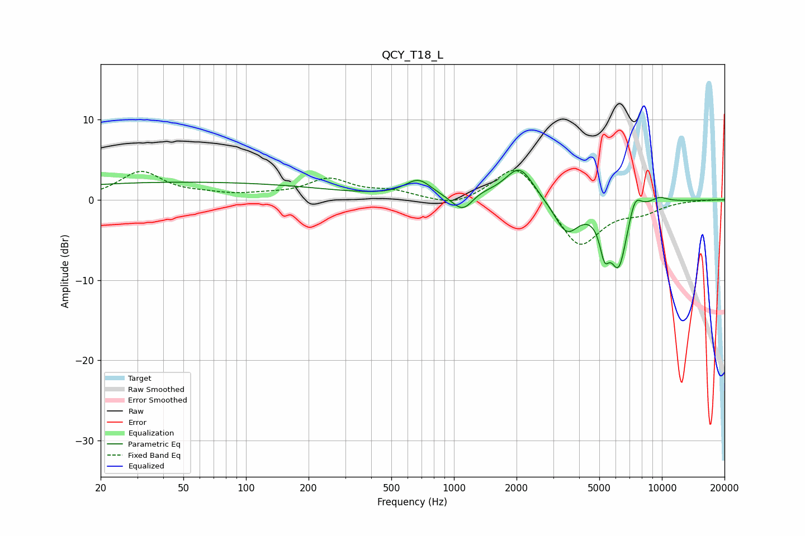

# QCY_T18_L
See [usage instructions](https://github.com/jaakkopasanen/AutoEq#usage) for more options and info.

### Parametric EQs
Apply preamp of -3.8 dB when using parametric equalizer.

|   # | Type    |   Fc (Hz) |    Q |   Gain (dB) |
|-----|---------|-----------|------|-------------|
|   1 | Peaking |        50 | 0.18 |         2.2 |
|   2 | Peaking |       675 | 2.2  |         2.2 |
|   3 | Peaking |      1108 | 2.68 |        -2.4 |
|   4 | Peaking |      1297 | 1.85 |         0.8 |
|   5 | Peaking |      2068 | 2.04 |         4.2 |
|   6 | Peaking |      3483 | 2.37 |        -4.1 |
|   7 | Peaking |      5298 | 6    |        -3.9 |
|   8 | Peaking |      6199 | 3.13 |        -8.1 |
|   9 | Peaking |      7410 | 4.31 |         2.7 |
|  10 | Peaking |      9713 | 3.06 |         0.7 |

### Fixed Band EQs
When using fixed band (also called graphic) equalizer, apply preamp of **-3.8 dB** (if available) and set gains manually with these parameters.

|   # | Type    |   Fc (Hz) |    Q |   Gain (dB) |
|-----|---------|-----------|------|-------------|
|   1 | Peaking |        31 | 1.41 |         3.4 |
|   2 | Peaking |        62 | 1.41 |         0.5 |
|   3 | Peaking |       125 | 1.41 |         0.4 |
|   4 | Peaking |       250 | 1.41 |         2.4 |
|   5 | Peaking |       500 | 1.41 |         0.9 |
|   6 | Peaking |      1000 | 1.41 |        -1   |
|   7 | Peaking |      2000 | 1.41 |         4.9 |
|   8 | Peaking |      4000 | 1.41 |        -6.2 |
|   9 | Peaking |      8000 | 1.41 |        -1.2 |
|  10 | Peaking |     16000 | 1.41 |         0   |

### Graphs

