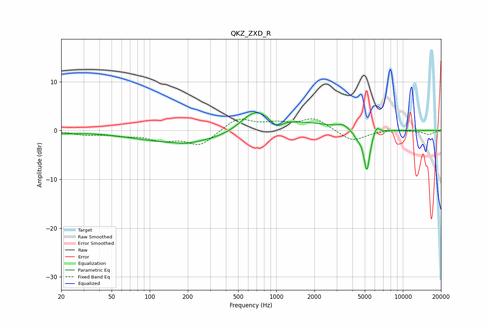

# QKZ_ZXD_R
See [usage instructions](https://github.com/jaakkopasanen/AutoEq#usage) for more options and info.

### Parametric EQs
Apply preamp of -3.7 dB when using parametric equalizer.

|   # | Type    |   Fc (Hz) |    Q |   Gain (dB) |
|-----|---------|-----------|------|-------------|
|   1 | Peaking |        20 | 1.15 |        -0.4 |
|   2 | Peaking |       194 | 2.24 |        -0.3 |
|   3 | Peaking |       200 | 0.34 |        -2.6 |
|   4 | Peaking |       681 | 1.21 |         4.4 |
|   5 | Peaking |      1002 | 3.2  |        -1.7 |
|   6 | Peaking |      1557 | 0.58 |         1.5 |
|   7 | Peaking |      3352 | 3.28 |         0.8 |
|   8 | Peaking |      4390 | 4.18 |        -1.3 |
|   9 | Peaking |      5190 | 5.82 |        -8.3 |
|  10 | Peaking |      6196 | 6    |         1.5 |

### Fixed Band EQs
When using fixed band (also called graphic) equalizer, apply preamp of **-2.5 dB** (if available) and set gains manually with these parameters.

|   # | Type    |   Fc (Hz) |    Q |   Gain (dB) |
|-----|---------|-----------|------|-------------|
|   1 | Peaking |        31 | 1.41 |        -0.8 |
|   2 | Peaking |        62 | 1.41 |        -0.8 |
|   3 | Peaking |       125 | 1.41 |        -1.7 |
|   4 | Peaking |       250 | 1.41 |        -3   |
|   5 | Peaking |       500 | 1.41 |         2.6 |
|   6 | Peaking |      1000 | 1.41 |         1.2 |
|   7 | Peaking |      2000 | 1.41 |         2.5 |
|   8 | Peaking |      4000 | 1.41 |        -2.3 |
|   9 | Peaking |      8000 | 1.41 |         0.2 |
|  10 | Peaking |     16000 | 1.41 |        -0.8 |

### Graphs

