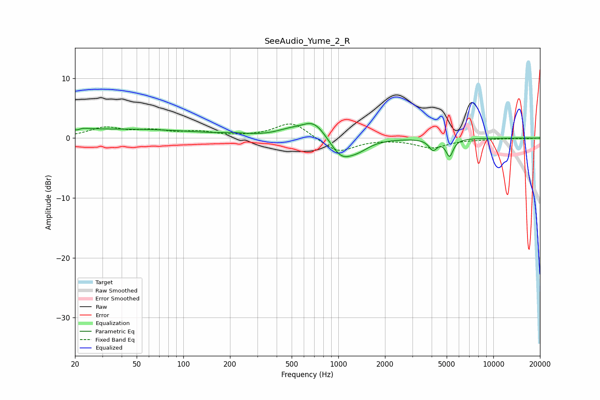

# SeeAudio_Yume_2_R
See [usage instructions](https://github.com/jaakkopasanen/AutoEq#usage) for more options and info.

### Parametric EQs
Apply preamp of -2.5 dB when using parametric equalizer.

|   # | Type    |   Fc (Hz) |    Q |   Gain (dB) |
|-----|---------|-----------|------|-------------|
|   1 | Peaking |        21 | 5.12 |        -1.3 |
|   2 | Peaking |        21 | 3.85 |         1.4 |
|   3 | Peaking |        38 | 0.25 |         1.5 |
|   4 | Peaking |       214 | 2.03 |         0.3 |
|   5 | Peaking |       474 | 1.71 |         0.8 |
|   6 | Peaking |       697 | 1.69 |         3.1 |
|   7 | Peaking |      1045 | 1.84 |        -3.5 |
|   8 | Peaking |      1355 | 2    |        -1.2 |
|   9 | Peaking |      4085 | 5.34 |        -1.8 |
|  10 | Peaking |      5216 | 6    |        -2.8 |

### Fixed Band EQs
When using fixed band (also called graphic) equalizer, apply preamp of **-2.4 dB** (if available) and set gains manually with these parameters.

|   # | Type    |   Fc (Hz) |    Q |   Gain (dB) |
|-----|---------|-----------|------|-------------|
|   1 | Peaking |        31 | 1.41 |         1.6 |
|   2 | Peaking |        62 | 1.41 |         1   |
|   3 | Peaking |       125 | 1.41 |         0.9 |
|   4 | Peaking |       250 | 1.41 |         0.1 |
|   5 | Peaking |       500 | 1.41 |         2.7 |
|   6 | Peaking |      1000 | 1.41 |        -2.5 |
|   7 | Peaking |      2000 | 1.41 |        -0   |
|   8 | Peaking |      4000 | 1.41 |        -1.6 |
|   9 | Peaking |      8000 | 1.41 |        -0.2 |
|  10 | Peaking |     16000 | 1.41 |        -0.1 |

### Graphs

