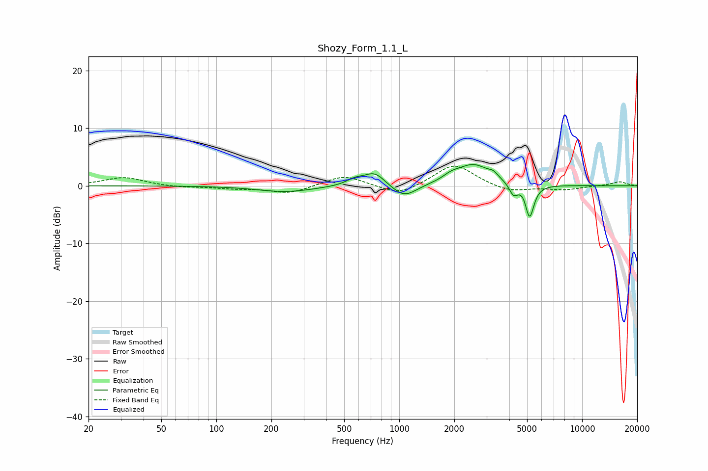

# Shozy_Form_1.1_L
See [usage instructions](https://github.com/jaakkopasanen/AutoEq#usage) for more options and info.

### Parametric EQs
Apply preamp of -3.8 dB when using parametric equalizer.

|   # | Type    |   Fc (Hz) |    Q |   Gain (dB) |
|-----|---------|-----------|------|-------------|
|   1 | Peaking |       239 | 0.94 |        -1.1 |
|   2 | Peaking |       571 | 2.96 |         0.9 |
|   3 | Peaking |       734 | 2.4  |         2.4 |
|   4 | Peaking |      1063 | 2.09 |        -2.3 |
|   5 | Peaking |      1925 | 3.16 |         0.8 |
|   6 | Peaking |      2549 | 1.53 |         3.6 |
|   7 | Peaking |      3271 | 5.7  |         0.7 |
|   8 | Peaking |      4217 | 5.92 |        -2   |
|   9 | Peaking |      4832 | 6    |         0.7 |
|  10 | Peaking |      5153 | 5.86 |        -6   |

### Fixed Band EQs
When using fixed band (also called graphic) equalizer, apply preamp of **-3.5 dB** (if available) and set gains manually with these parameters.

|   # | Type    |   Fc (Hz) |    Q |   Gain (dB) |
|-----|---------|-----------|------|-------------|
|   1 | Peaking |        31 | 1.41 |         1.5 |
|   2 | Peaking |        62 | 1.41 |        -0.3 |
|   3 | Peaking |       125 | 1.41 |        -0.4 |
|   4 | Peaking |       250 | 1.41 |        -1.3 |
|   5 | Peaking |       500 | 1.41 |         1.9 |
|   6 | Peaking |      1000 | 1.41 |        -1.8 |
|   7 | Peaking |      2000 | 1.41 |         3.9 |
|   8 | Peaking |      4000 | 1.41 |        -1.2 |
|   9 | Peaking |      8000 | 1.41 |        -0.7 |
|  10 | Peaking |     16000 | 1.41 |         0.7 |

### Graphs

