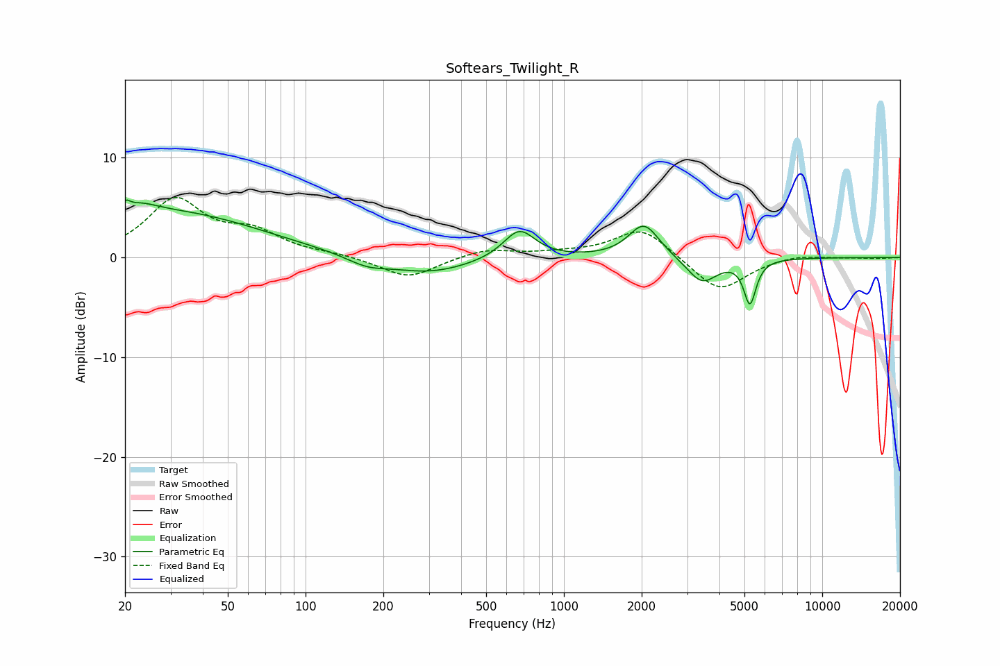

# Softears_Twilight_R
See [usage instructions](https://github.com/jaakkopasanen/AutoEq#usage) for more options and info.

### Parametric EQs
Apply preamp of -5.9 dB when using parametric equalizer.

|   # | Type    |   Fc (Hz) |    Q |   Gain (dB) |
|-----|---------|-----------|------|-------------|
|   1 | Peaking |        20 | 5.92 |         3.2 |
|   2 | Peaking |        21 | 6    |        -2.4 |
|   3 | Peaking |        23 | 1.89 |         1.3 |
|   4 | Peaking |        31 | 0.42 |         4.3 |
|   5 | Peaking |       173 | 1.79 |        -0.9 |
|   6 | Peaking |       300 | 0.87 |        -1.6 |
|   7 | Peaking |       672 | 2.3  |         3   |
|   8 | Peaking |      2042 | 2.39 |         3.4 |
|   9 | Peaking |      3426 | 2.39 |        -2.6 |
|  10 | Peaking |      5249 | 6    |        -4.4 |

### Fixed Band EQs
When using fixed band (also called graphic) equalizer, apply preamp of **-6.1 dB** (if available) and set gains manually with these parameters.

|   # | Type    |   Fc (Hz) |    Q |   Gain (dB) |
|-----|---------|-----------|------|-------------|
|   1 | Peaking |        31 | 1.41 |         5.6 |
|   2 | Peaking |        62 | 1.41 |         2.2 |
|   3 | Peaking |       125 | 1.41 |         0.3 |
|   4 | Peaking |       250 | 1.41 |        -2.1 |
|   5 | Peaking |       500 | 1.41 |         0.8 |
|   6 | Peaking |      1000 | 1.41 |         0.3 |
|   7 | Peaking |      2000 | 1.41 |         3.1 |
|   8 | Peaking |      4000 | 1.41 |        -3.5 |
|   9 | Peaking |      8000 | 1.41 |         0.4 |
|  10 | Peaking |     16000 | 1.41 |        -0.1 |

### Graphs

