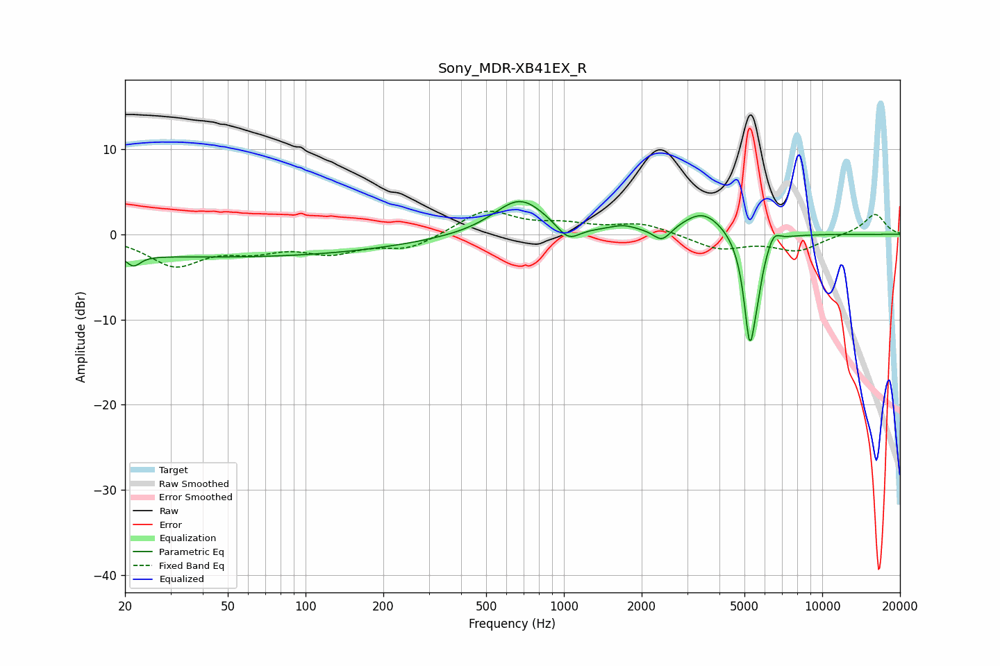

# Sony_MDR-XB41EX_R
See [usage instructions](https://github.com/jaakkopasanen/AutoEq#usage) for more options and info.

### Parametric EQs
Apply preamp of -3.9 dB when using parametric equalizer.

|   # | Type    |   Fc (Hz) |    Q |   Gain (dB) |
|-----|---------|-----------|------|-------------|
|   1 | Peaking |        22 | 5.4  |        -1.3 |
|   2 | Peaking |        47 | 0.18 |        -2.7 |
|   3 | Peaking |       676 | 1.39 |         4.3 |
|   4 | Peaking |      1039 | 3.15 |        -1.9 |
|   5 | Peaking |      1696 | 2.72 |         0.7 |
|   6 | Peaking |      2401 | 4.14 |        -1.6 |
|   7 | Peaking |      3460 | 1.72 |         2.8 |
|   8 | Peaking |      5239 | 5.97 |       -11.9 |
|   9 | Peaking |      5592 | 6    |        -2.9 |
|  10 | Peaking |      6493 | 5.92 |         1.3 |

### Fixed Band EQs
When using fixed band (also called graphic) equalizer, apply preamp of **-2.8 dB** (if available) and set gains manually with these parameters.

|   # | Type    |   Fc (Hz) |    Q |   Gain (dB) |
|-----|---------|-----------|------|-------------|
|   1 | Peaking |        31 | 1.41 |        -3.5 |
|   2 | Peaking |        62 | 1.41 |        -1.5 |
|   3 | Peaking |       125 | 1.41 |        -1.9 |
|   4 | Peaking |       250 | 1.41 |        -1.7 |
|   5 | Peaking |       500 | 1.41 |         2.9 |
|   6 | Peaking |      1000 | 1.41 |         1   |
|   7 | Peaking |      2000 | 1.41 |         1.3 |
|   8 | Peaking |      4000 | 1.41 |        -1.7 |
|   9 | Peaking |      8000 | 1.41 |        -1.9 |
|  10 | Peaking |     16000 | 1.41 |         2.4 |

### Graphs

