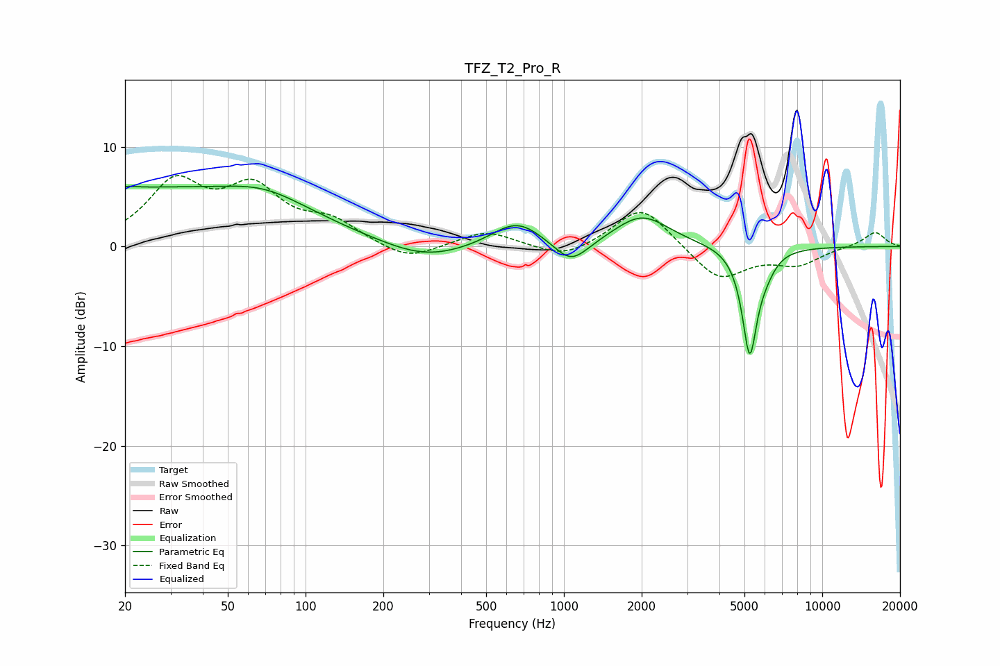

# TFZ_T2_Pro_R
See [usage instructions](https://github.com/jaakkopasanen/AutoEq#usage) for more options and info.

### Parametric EQs
Apply preamp of -6.2 dB when using parametric equalizer.

|   # | Type    |   Fc (Hz) |    Q |   Gain (dB) |
|-----|---------|-----------|------|-------------|
|   1 | Peaking |        20 | 5.93 |        -2.7 |
|   2 | Peaking |        20 | 5.78 |         2.9 |
|   3 | Peaking |        21 | 0.2  |         5.7 |
|   4 | Peaking |        70 | 0.92 |         1.6 |
|   5 | Peaking |       290 | 0.84 |        -1.7 |
|   6 | Peaking |       658 | 1.43 |         2.7 |
|   7 | Peaking |      1066 | 2.09 |        -2.5 |
|   8 | Peaking |      2003 | 1.33 |         3.1 |
|   9 | Peaking |      5239 | 4.72 |       -10.6 |
|  10 | Peaking |      6048 | 3.69 |        -1.1 |

### Fixed Band EQs
When using fixed band (also called graphic) equalizer, apply preamp of **-7.2 dB** (if available) and set gains manually with these parameters.

|   # | Type    |   Fc (Hz) |    Q |   Gain (dB) |
|-----|---------|-----------|------|-------------|
|   1 | Peaking |        31 | 1.41 |         6   |
|   2 | Peaking |        62 | 1.41 |         5.2 |
|   3 | Peaking |       125 | 1.41 |         2.2 |
|   4 | Peaking |       250 | 1.41 |        -1.6 |
|   5 | Peaking |       500 | 1.41 |         1.6 |
|   6 | Peaking |      1000 | 1.41 |        -1.4 |
|   7 | Peaking |      2000 | 1.41 |         4.2 |
|   8 | Peaking |      4000 | 1.41 |        -3.4 |
|   9 | Peaking |      8000 | 1.41 |        -1.7 |
|  10 | Peaking |     16000 | 1.41 |         1.5 |

### Graphs

