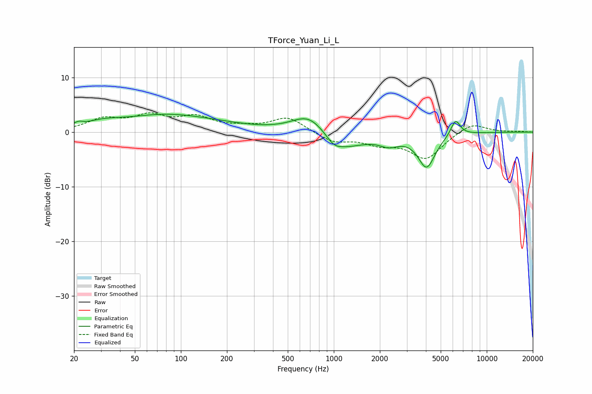

# TForce_Yuan_Li_L
See [usage instructions](https://github.com/jaakkopasanen/AutoEq#usage) for more options and info.

### Parametric EQs
Apply preamp of -3.4 dB when using parametric equalizer.

|   # | Type    |   Fc (Hz) |    Q |   Gain (dB) |
|-----|---------|-----------|------|-------------|
|   1 | Peaking |        21 | 4.76 |         0.7 |
|   2 | Peaking |        31 | 1.31 |         0.9 |
|   3 | Peaking |        80 | 0.47 |         3   |
|   4 | Peaking |       200 | 0.66 |         0.4 |
|   5 | Peaking |       689 | 1.28 |         3.6 |
|   6 | Peaking |      1001 | 2.89 |        -1.3 |
|   7 | Peaking |      1168 | 1.03 |        -3   |
|   8 | Peaking |      2297 | 2.2  |        -1.6 |
|   9 | Peaking |      4043 | 2.48 |        -6.2 |
|  10 | Peaking |      6250 | 4.41 |         3   |

### Fixed Band EQs
When using fixed band (also called graphic) equalizer, apply preamp of **-3.6 dB** (if available) and set gains manually with these parameters.

|   # | Type    |   Fc (Hz) |    Q |   Gain (dB) |
|-----|---------|-----------|------|-------------|
|   1 | Peaking |        31 | 1.41 |         2.2 |
|   2 | Peaking |        62 | 1.41 |         2.6 |
|   3 | Peaking |       125 | 1.41 |         2.4 |
|   4 | Peaking |       250 | 1.41 |         0.6 |
|   5 | Peaking |       500 | 1.41 |         2.7 |
|   6 | Peaking |      1000 | 1.41 |        -1.8 |
|   7 | Peaking |      2000 | 1.41 |        -1.8 |
|   8 | Peaking |      4000 | 1.41 |        -4.7 |
|   9 | Peaking |      8000 | 1.41 |         1.8 |
|  10 | Peaking |     16000 | 1.41 |         0.1 |

### Graphs

