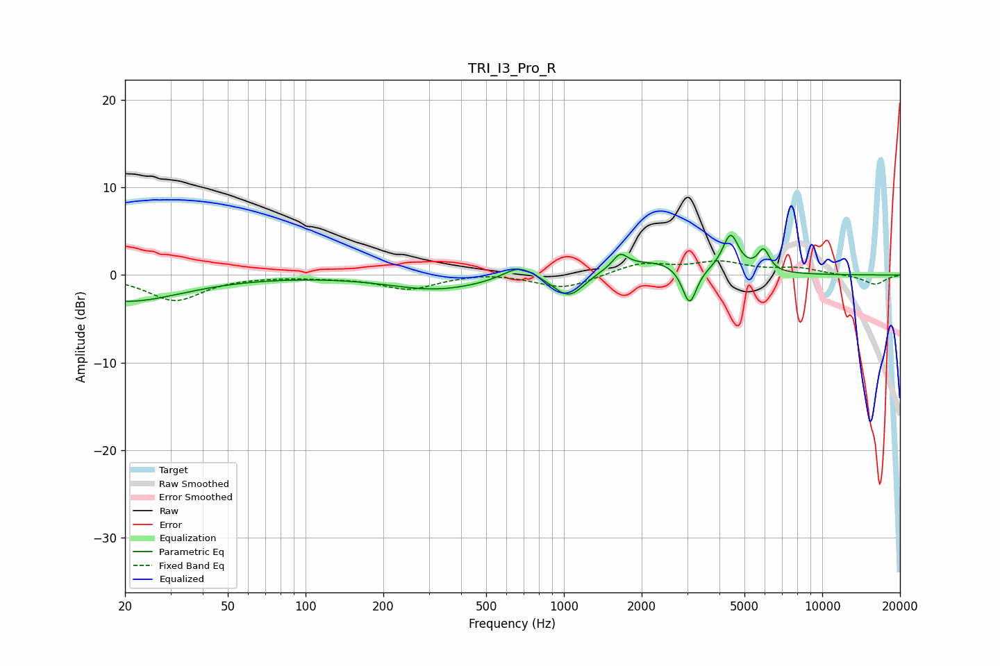

# TRI_I3_Pro_R
See [usage instructions](https://github.com/jaakkopasanen/AutoEq#usage) for more options and info.

### Parametric EQs
Apply preamp of -4.6 dB when using parametric equalizer.

|   # | Type    |   Fc (Hz) |    Q |   Gain (dB) |
|-----|---------|-----------|------|-------------|
|   1 | Peaking |        20 | 0.63 |        -3   |
|   2 | Peaking |       322 | 0.77 |        -1.6 |
|   3 | Peaking |       673 | 2.31 |         1.6 |
|   4 | Peaking |      1047 | 2.33 |        -2.8 |
|   5 | Peaking |      1649 | 5.4  |         1.4 |
|   6 | Peaking |      2016 | 2.33 |        -0.7 |
|   7 | Peaking |      2036 | 1.13 |         2.3 |
|   8 | Peaking |      3065 | 5.21 |        -4.3 |
|   9 | Peaking |      4420 | 4.54 |         4.3 |
|  10 | Peaking |      5930 | 6    |         2.4 |

### Fixed Band EQs
When using fixed band (also called graphic) equalizer, apply preamp of **-1.7 dB** (if available) and set gains manually with these parameters.

|   # | Type    |   Fc (Hz) |    Q |   Gain (dB) |
|-----|---------|-----------|------|-------------|
|   1 | Peaking |        31 | 1.41 |        -2.9 |
|   2 | Peaking |        62 | 1.41 |        -0.1 |
|   3 | Peaking |       125 | 1.41 |        -0.2 |
|   4 | Peaking |       250 | 1.41 |        -1.6 |
|   5 | Peaking |       500 | 1.41 |         0.3 |
|   6 | Peaking |      1000 | 1.41 |        -1.6 |
|   7 | Peaking |      2000 | 1.41 |         1.3 |
|   8 | Peaking |      4000 | 1.41 |         1.4 |
|   9 | Peaking |      8000 | 1.41 |         0.7 |
|  10 | Peaking |     16000 | 1.41 |        -1.1 |

### Graphs

