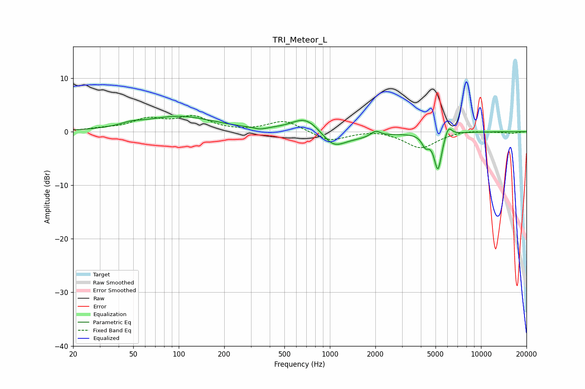

# TRI_Meteor_L
See [usage instructions](https://github.com/jaakkopasanen/AutoEq#usage) for more options and info.

### Parametric EQs
Apply preamp of -3.0 dB when using parametric equalizer.

|   # | Type    |   Fc (Hz) |    Q |   Gain (dB) |
|-----|---------|-----------|------|-------------|
|   1 | Peaking |        48 | 2.09 |         0.6 |
|   2 | Peaking |       101 | 0.61 |         2.8 |
|   3 | Peaking |       346 | 3.54 |        -0.4 |
|   4 | Peaking |       696 | 1.48 |         2.9 |
|   5 | Peaking |      1054 | 1.84 |        -2.8 |
|   6 | Peaking |      1612 | 0.94 |        -1   |
|   7 | Peaking |      2007 | 4.29 |         1.1 |
|   8 | Peaking |      4289 | 5.92 |        -2   |
|   9 | Peaking |      5187 | 5.56 |        -6.9 |
|  10 | Peaking |      6081 | 5.99 |         2   |

### Fixed Band EQs
When using fixed band (also called graphic) equalizer, apply preamp of **-3.1 dB** (if available) and set gains manually with these parameters.

|   # | Type    |   Fc (Hz) |    Q |   Gain (dB) |
|-----|---------|-----------|------|-------------|
|   1 | Peaking |        31 | 1.41 |         0.4 |
|   2 | Peaking |        62 | 1.41 |         2.1 |
|   3 | Peaking |       125 | 1.41 |         2.5 |
|   4 | Peaking |       250 | 1.41 |        -0   |
|   5 | Peaking |       500 | 1.41 |         2.1 |
|   6 | Peaking |      1000 | 1.41 |        -1.8 |
|   7 | Peaking |      2000 | 1.41 |         0.4 |
|   8 | Peaking |      4000 | 1.41 |        -3.1 |
|   9 | Peaking |      8000 | 1.41 |         0.3 |
|  10 | Peaking |     16000 | 1.41 |        -0.3 |

### Graphs

