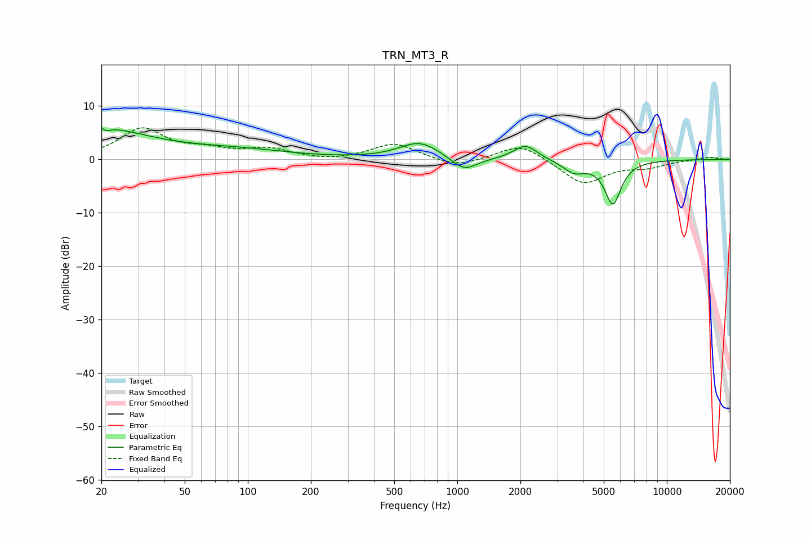

# TRN_MT3_R
See [usage instructions](https://github.com/jaakkopasanen/AutoEq#usage) for more options and info.

### Parametric EQs
Apply preamp of -6.0 dB when using parametric equalizer.

|   # | Type    |   Fc (Hz) |    Q |   Gain (dB) |
|-----|---------|-----------|------|-------------|
|   1 | Peaking |        20 | 0.56 |         4.9 |
|   2 | Peaking |        20 | 1.16 |         0.7 |
|   3 | Peaking |        20 | 5.77 |         3.2 |
|   4 | Peaking |        21 | 5.97 |        -3.4 |
|   5 | Peaking |        89 | 0.56 |         1.5 |
|   6 | Peaking |       661 | 1.46 |         3.2 |
|   7 | Peaking |      1078 | 2.3  |        -2.6 |
|   8 | Peaking |      2114 | 2.52 |         2.8 |
|   9 | Peaking |      3608 | 2.61 |        -2.2 |
|  10 | Peaking |      5527 | 3.53 |        -8.2 |

### Fixed Band EQs
When using fixed band (also called graphic) equalizer, apply preamp of **-6.0 dB** (if available) and set gains manually with these parameters.

|   # | Type    |   Fc (Hz) |    Q |   Gain (dB) |
|-----|---------|-----------|------|-------------|
|   1 | Peaking |        31 | 1.41 |         5.6 |
|   2 | Peaking |        62 | 1.41 |         1.4 |
|   3 | Peaking |       125 | 1.41 |         1.8 |
|   4 | Peaking |       250 | 1.41 |        -0.4 |
|   5 | Peaking |       500 | 1.41 |         3   |
|   6 | Peaking |      1000 | 1.41 |        -1.6 |
|   7 | Peaking |      2000 | 1.41 |         3.1 |
|   8 | Peaking |      4000 | 1.41 |        -4.7 |
|   9 | Peaking |      8000 | 1.41 |        -1.2 |
|  10 | Peaking |     16000 | 1.41 |         0.5 |

### Graphs

