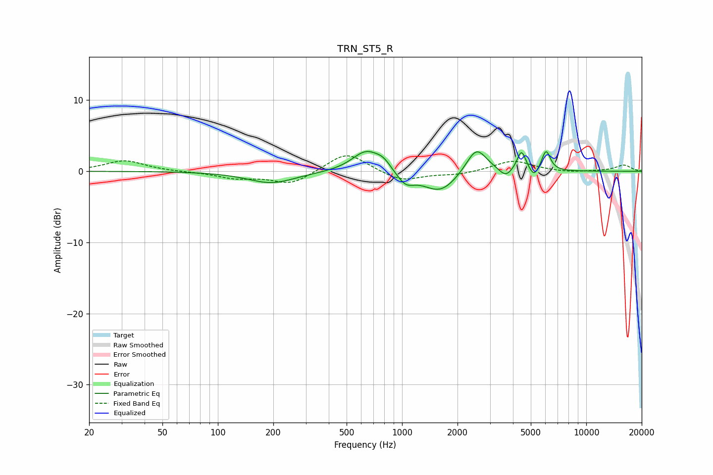

# TRN_ST5_R
See [usage instructions](https://github.com/jaakkopasanen/AutoEq#usage) for more options and info.

### Parametric EQs
Apply preamp of -2.9 dB when using parametric equalizer.

|   # | Type    |   Fc (Hz) |    Q |   Gain (dB) |
|-----|---------|-----------|------|-------------|
|   1 | Peaking |       195 | 1.09 |        -1.7 |
|   2 | Peaking |       640 | 1.83 |         3   |
|   3 | Peaking |       792 | 3.45 |         1   |
|   4 | Peaking |      1043 | 2.99 |        -1.7 |
|   5 | Peaking |      1613 | 1.5  |        -3   |
|   6 | Peaking |      2532 | 2.51 |         3.8 |
|   7 | Peaking |      3651 | 4.17 |        -1.2 |
|   8 | Peaking |      4449 | 5.98 |         2.9 |
|   9 | Peaking |      5206 | 6    |        -1.3 |
|  10 | Peaking |      6049 | 5.98 |         2.9 |

### Fixed Band EQs
When using fixed band (also called graphic) equalizer, apply preamp of **-2.3 dB** (if available) and set gains manually with these parameters.

|   # | Type    |   Fc (Hz) |    Q |   Gain (dB) |
|-----|---------|-----------|------|-------------|
|   1 | Peaking |        31 | 1.41 |         1.5 |
|   2 | Peaking |        62 | 1.41 |        -0.1 |
|   3 | Peaking |       125 | 1.41 |        -0.9 |
|   4 | Peaking |       250 | 1.41 |        -1.8 |
|   5 | Peaking |       500 | 1.41 |         2.8 |
|   6 | Peaking |      1000 | 1.41 |        -1.4 |
|   7 | Peaking |      2000 | 1.41 |        -0.5 |
|   8 | Peaking |      4000 | 1.41 |         1.5 |
|   9 | Peaking |      8000 | 1.41 |        -0.2 |
|  10 | Peaking |     16000 | 1.41 |         0.9 |

### Graphs

