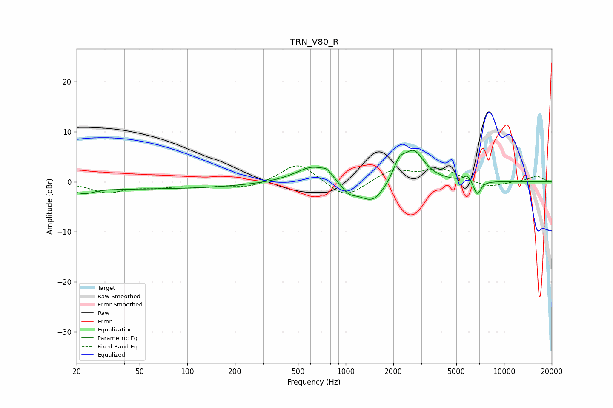

# TRN_V80_R
See [usage instructions](https://github.com/jaakkopasanen/AutoEq#usage) for more options and info.

### Parametric EQs
Apply preamp of -6.4 dB when using parametric equalizer.

|   # | Type    |   Fc (Hz) |    Q |   Gain (dB) |
|-----|---------|-----------|------|-------------|
|   1 | Peaking |        22 | 2.5  |        -1.1 |
|   2 | Peaking |        48 | 0.18 |        -1.4 |
|   3 | Peaking |       629 | 1.28 |         3.5 |
|   4 | Peaking |       763 | 5.31 |         0.9 |
|   5 | Peaking |      1047 | 2.65 |        -2.2 |
|   6 | Peaking |      1485 | 1.69 |        -4.5 |
|   7 | Peaking |      2177 | 3.67 |         3.2 |
|   8 | Peaking |      2691 | 2.1  |         6.1 |
|   9 | Peaking |      5872 | 6    |         1.3 |
|  10 | Peaking |      6776 | 5.94 |        -2.9 |

### Fixed Band EQs
When using fixed band (also called graphic) equalizer, apply preamp of **-3.3 dB** (if available) and set gains manually with these parameters.

|   # | Type    |   Fc (Hz) |    Q |   Gain (dB) |
|-----|---------|-----------|------|-------------|
|   1 | Peaking |        31 | 1.41 |        -2   |
|   2 | Peaking |        62 | 1.41 |        -0.9 |
|   3 | Peaking |       125 | 1.41 |        -0.8 |
|   4 | Peaking |       250 | 1.41 |        -1.2 |
|   5 | Peaking |       500 | 1.41 |         4   |
|   6 | Peaking |      1000 | 1.41 |        -3.5 |
|   7 | Peaking |      2000 | 1.41 |         2.4 |
|   8 | Peaking |      4000 | 1.41 |         2.4 |
|   9 | Peaking |      8000 | 1.41 |        -1.2 |
|  10 | Peaking |     16000 | 1.41 |         1.2 |

### Graphs

