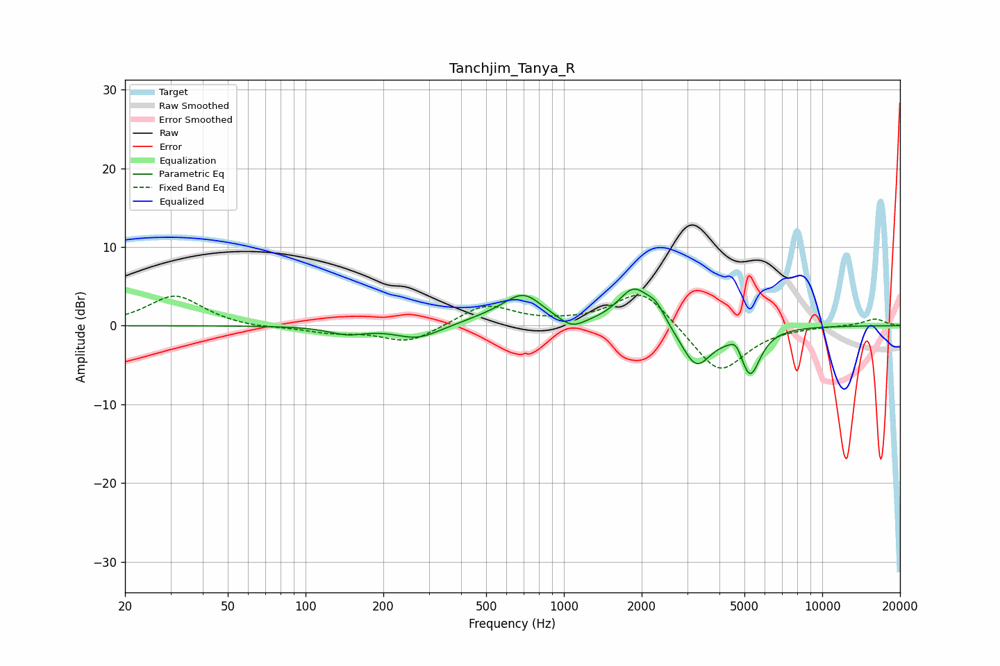

# Tanchjim_Tanya_R
See [usage instructions](https://github.com/jaakkopasanen/AutoEq#usage) for more options and info.

### Parametric EQs
Apply preamp of -4.7 dB when using parametric equalizer.

|   # | Type    |   Fc (Hz) |    Q |   Gain (dB) |
|-----|---------|-----------|------|-------------|
|   1 | Peaking |       145 | 2    |        -1   |
|   2 | Peaking |       272 | 1.62 |        -1.7 |
|   3 | Peaking |       530 | 1.19 |         0.8 |
|   4 | Peaking |       699 | 1.87 |         3.5 |
|   5 | Peaking |      1074 | 2.85 |        -1.4 |
|   6 | Peaking |      1866 | 2.27 |         4.7 |
|   7 | Peaking |      2276 | 3.96 |         1.8 |
|   8 | Peaking |      3252 | 2.39 |        -5.2 |
|   9 | Peaking |      4645 | 5.74 |         1.5 |
|  10 | Peaking |      5252 | 3.47 |        -6   |

### Fixed Band EQs
When using fixed band (also called graphic) equalizer, apply preamp of **-4.0 dB** (if available) and set gains manually with these parameters.

|   # | Type    |   Fc (Hz) |    Q |   Gain (dB) |
|-----|---------|-----------|------|-------------|
|   1 | Peaking |        31 | 1.41 |         3.8 |
|   2 | Peaking |        62 | 1.41 |        -0.3 |
|   3 | Peaking |       125 | 1.41 |        -0.8 |
|   4 | Peaking |       250 | 1.41 |        -2.2 |
|   5 | Peaking |       500 | 1.41 |         2.7 |
|   6 | Peaking |      1000 | 1.41 |         0.2 |
|   7 | Peaking |      2000 | 1.41 |         4.8 |
|   8 | Peaking |      4000 | 1.41 |        -6.2 |
|   9 | Peaking |      8000 | 1.41 |        -0   |
|  10 | Peaking |     16000 | 1.41 |         0.9 |

### Graphs

