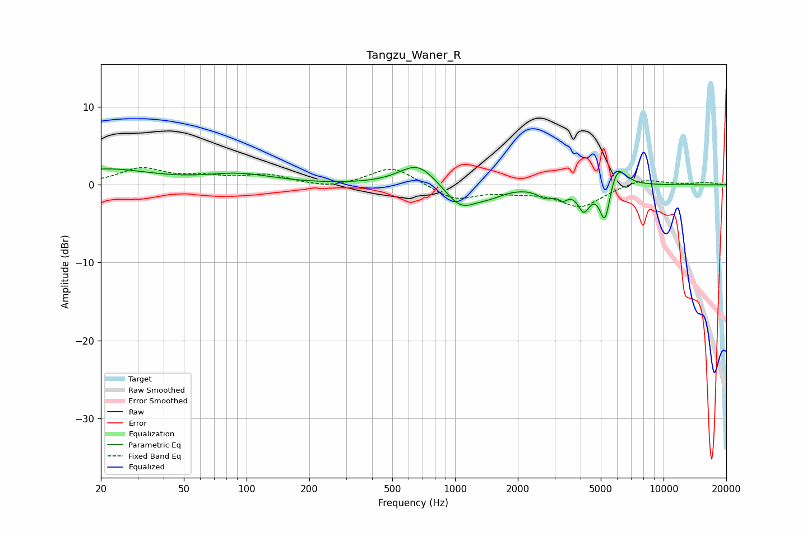

# Tangzu_Waner_R
See [usage instructions](https://github.com/jaakkopasanen/AutoEq#usage) for more options and info.

### Parametric EQs
Apply preamp of -2.3 dB when using parametric equalizer.

|   # | Type    |   Fc (Hz) |    Q |   Gain (dB) |
|-----|---------|-----------|------|-------------|
|   1 | Peaking |        21 | 0.66 |         2   |
|   2 | Peaking |        93 | 0.86 |         1.2 |
|   3 | Peaking |       664 | 1.58 |         2.9 |
|   4 | Peaking |      1064 | 1.85 |        -3   |
|   5 | Peaking |      1469 | 1.94 |        -1   |
|   6 | Peaking |      2727 | 3.4  |        -1.2 |
|   7 | Peaking |      3293 | 5.9  |        -1.1 |
|   8 | Peaking |      4147 | 4.83 |        -3   |
|   9 | Peaking |      5241 | 5.43 |        -5.3 |
|  10 | Peaking |      5967 | 3.26 |         3.1 |

### Fixed Band EQs
When using fixed band (also called graphic) equalizer, apply preamp of **-2.3 dB** (if available) and set gains manually with these parameters.

|   # | Type    |   Fc (Hz) |    Q |   Gain (dB) |
|-----|---------|-----------|------|-------------|
|   1 | Peaking |        31 | 1.41 |         2   |
|   2 | Peaking |        62 | 1.41 |         0.8 |
|   3 | Peaking |       125 | 1.41 |         1.2 |
|   4 | Peaking |       250 | 1.41 |        -0.5 |
|   5 | Peaking |       500 | 1.41 |         2.4 |
|   6 | Peaking |      1000 | 1.41 |        -1.9 |
|   7 | Peaking |      2000 | 1.41 |        -0.7 |
|   8 | Peaking |      4000 | 1.41 |        -2.8 |
|   9 | Peaking |      8000 | 1.41 |         0.9 |
|  10 | Peaking |     16000 | 1.41 |         0.3 |

### Graphs

