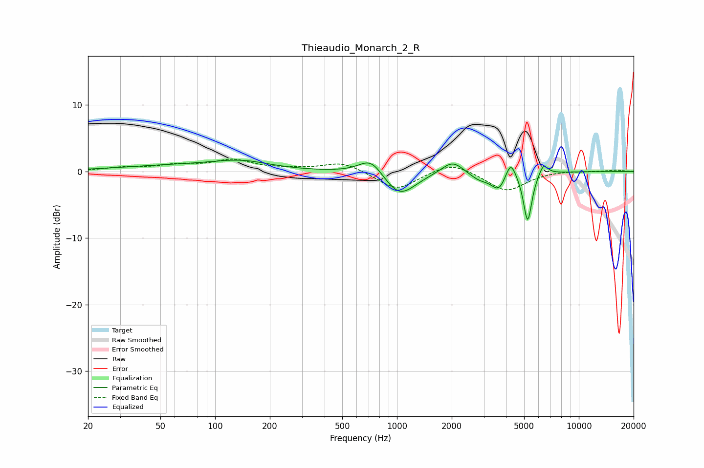

# Thieaudio_Monarch_2_R
See [usage instructions](https://github.com/jaakkopasanen/AutoEq#usage) for more options and info.

### Parametric EQs
Apply preamp of -1.8 dB when using parametric equalizer.

|   # | Type    |   Fc (Hz) |    Q |   Gain (dB) |
|-----|---------|-----------|------|-------------|
|   1 | Peaking |        61 | 0.44 |         0.8 |
|   2 | Peaking |       140 | 0.92 |         1.2 |
|   3 | Peaking |       722 | 2.09 |         2.7 |
|   4 | Peaking |      1030 | 1.59 |        -3.9 |
|   5 | Peaking |      2024 | 2.3  |         2.1 |
|   6 | Peaking |      2846 | 2.28 |        -1.2 |
|   7 | Peaking |      3635 | 3.57 |        -2.5 |
|   8 | Peaking |      4216 | 4.99 |         2.8 |
|   9 | Peaking |      5229 | 6    |        -7.6 |
|  10 | Peaking |      6383 | 5.62 |         1.7 |

### Fixed Band EQs
When using fixed band (also called graphic) equalizer, apply preamp of **-2.0 dB** (if available) and set gains manually with these parameters.

|   # | Type    |   Fc (Hz) |    Q |   Gain (dB) |
|-----|---------|-----------|------|-------------|
|   1 | Peaking |        31 | 1.41 |         0.5 |
|   2 | Peaking |        62 | 1.41 |         0.8 |
|   3 | Peaking |       125 | 1.41 |         1.6 |
|   4 | Peaking |       250 | 1.41 |         0.3 |
|   5 | Peaking |       500 | 1.41 |         1.5 |
|   6 | Peaking |      1000 | 1.41 |        -2.8 |
|   7 | Peaking |      2000 | 1.41 |         1.6 |
|   8 | Peaking |      4000 | 1.41 |        -3   |
|   9 | Peaking |      8000 | 1.41 |         0.2 |
|  10 | Peaking |     16000 | 1.41 |         0.2 |

### Graphs

