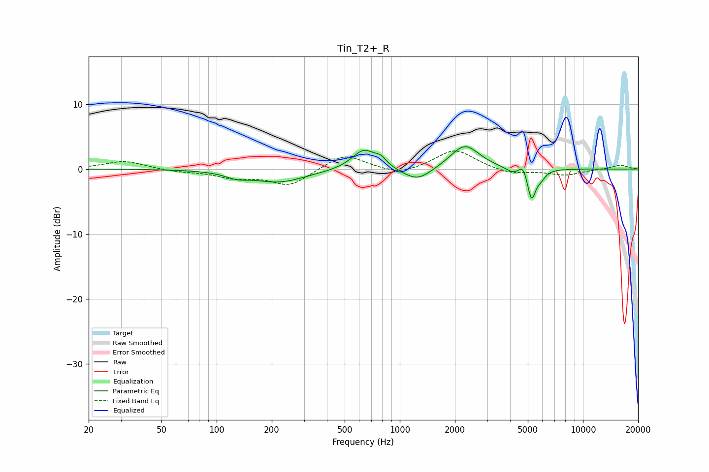

# Tin_T2+_R
See [usage instructions](https://github.com/jaakkopasanen/AutoEq#usage) for more options and info.

### Parametric EQs
Apply preamp of -3.5 dB when using parametric equalizer.

|   # | Type    |   Fc (Hz) |    Q |   Gain (dB) |
|-----|---------|-----------|------|-------------|
|   1 | Peaking |       129 | 2.33 |        -0.8 |
|   2 | Peaking |       219 | 0.97 |        -2   |
|   3 | Peaking |       637 | 2.18 |         3.1 |
|   4 | Peaking |       789 | 4.7  |         1   |
|   5 | Peaking |      1246 | 1.81 |        -2.1 |
|   6 | Peaking |      2265 | 1.8  |         3.8 |
|   7 | Peaking |      4139 | 3.62 |        -0.8 |
|   8 | Peaking |      4719 | 6    |         1.6 |
|   9 | Peaking |      5238 | 5.99 |        -4.8 |
|  10 | Peaking |      5918 | 5.84 |        -1   |

### Fixed Band EQs
When using fixed band (also called graphic) equalizer, apply preamp of **-2.9 dB** (if available) and set gains manually with these parameters.

|   # | Type    |   Fc (Hz) |    Q |   Gain (dB) |
|-----|---------|-----------|------|-------------|
|   1 | Peaking |        31 | 1.41 |         1.3 |
|   2 | Peaking |        62 | 1.41 |        -0.4 |
|   3 | Peaking |       125 | 1.41 |        -1.2 |
|   4 | Peaking |       250 | 1.41 |        -2.5 |
|   5 | Peaking |       500 | 1.41 |         2.4 |
|   6 | Peaking |      1000 | 1.41 |        -1.1 |
|   7 | Peaking |      2000 | 1.41 |         3.1 |
|   8 | Peaking |      4000 | 1.41 |        -0.8 |
|   9 | Peaking |      8000 | 1.41 |        -0.9 |
|  10 | Peaking |     16000 | 1.41 |         0.6 |

### Graphs

