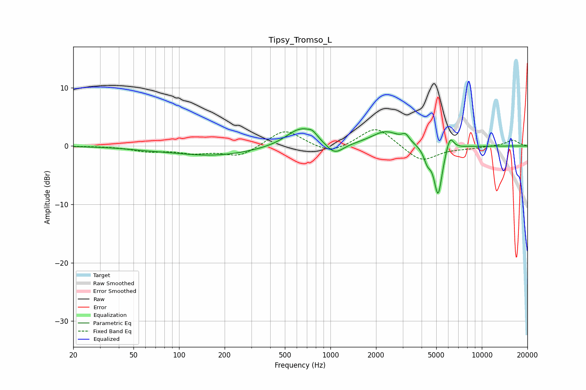

# Tipsy_Tromso_L
See [usage instructions](https://github.com/jaakkopasanen/AutoEq#usage) for more options and info.

### Parametric EQs
Apply preamp of -3.0 dB when using parametric equalizer.

|   # | Type    |   Fc (Hz) |    Q |   Gain (dB) |
|-----|---------|-----------|------|-------------|
|   1 | Peaking |        59 | 1.14 |        -0.2 |
|   2 | Peaking |       169 | 0.51 |        -1.6 |
|   3 | Peaking |       640 | 1.45 |         3.3 |
|   4 | Peaking |       761 | 5.01 |         0.7 |
|   5 | Peaking |      1065 | 2.46 |        -2.1 |
|   6 | Peaking |      2323 | 1.48 |         2.5 |
|   7 | Peaking |      3134 | 5.99 |         1.1 |
|   8 | Peaking |      4372 | 5.88 |        -2.1 |
|   9 | Peaking |      5142 | 5.1  |        -8.4 |
|  10 | Peaking |      6161 | 5.68 |         2.6 |

### Fixed Band EQs
When using fixed band (also called graphic) equalizer, apply preamp of **-2.9 dB** (if available) and set gains manually with these parameters.

|   # | Type    |   Fc (Hz) |    Q |   Gain (dB) |
|-----|---------|-----------|------|-------------|
|   1 | Peaking |        31 | 1.41 |        -0   |
|   2 | Peaking |        62 | 1.41 |        -0.8 |
|   3 | Peaking |       125 | 1.41 |        -1   |
|   4 | Peaking |       250 | 1.41 |        -1.8 |
|   5 | Peaking |       500 | 1.41 |         3   |
|   6 | Peaking |      1000 | 1.41 |        -1.5 |
|   7 | Peaking |      2000 | 1.41 |         3.5 |
|   8 | Peaking |      4000 | 1.41 |        -2.8 |
|   9 | Peaking |      8000 | 1.41 |        -0.3 |
|  10 | Peaking |     16000 | 1.41 |         1   |

### Graphs

