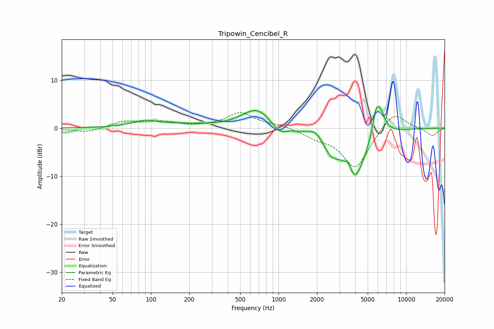

# Tripowin_Cencibel_R
See [usage instructions](https://github.com/jaakkopasanen/AutoEq#usage) for more options and info.

### Parametric EQs
Apply preamp of -4.5 dB when using parametric equalizer.

|   # | Type    |   Fc (Hz) |    Q |   Gain (dB) |
|-----|---------|-----------|------|-------------|
|   1 | Peaking |        90 | 1.33 |         1.2 |
|   2 | Peaking |       176 | 0.64 |         0.6 |
|   3 | Peaking |       675 | 1.23 |         4.1 |
|   4 | Peaking |      1030 | 2.19 |        -2.1 |
|   5 | Peaking |      1962 | 3.45 |         1.3 |
|   6 | Peaking |      2595 | 2.24 |        -3.5 |
|   7 | Peaking |      3517 | 6    |         1.5 |
|   8 | Peaking |      3989 | 1.7  |       -10.1 |
|   9 | Peaking |      5777 | 5.35 |         3.5 |
|  10 | Peaking |      6213 | 3.3  |         5.1 |

### Fixed Band EQs
When using fixed band (also called graphic) equalizer, apply preamp of **-3.3 dB** (if available) and set gains manually with these parameters.

|   # | Type    |   Fc (Hz) |    Q |   Gain (dB) |
|-----|---------|-----------|------|-------------|
|   1 | Peaking |        31 | 1.41 |        -0.9 |
|   2 | Peaking |        62 | 1.41 |         1.4 |
|   3 | Peaking |       125 | 1.41 |         1.2 |
|   4 | Peaking |       250 | 1.41 |         0.1 |
|   5 | Peaking |       500 | 1.41 |         3.2 |
|   6 | Peaking |      1000 | 1.41 |         0.6 |
|   7 | Peaking |      2000 | 1.41 |        -1.5 |
|   8 | Peaking |      4000 | 1.41 |        -8.4 |
|   9 | Peaking |      8000 | 1.41 |         3.8 |
|  10 | Peaking |     16000 | 1.41 |        -1.7 |

### Graphs

