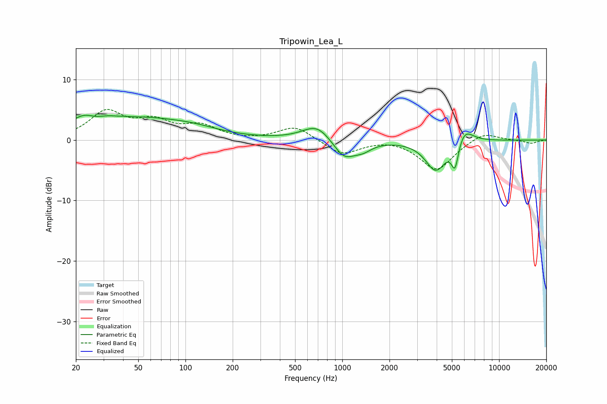

# Tripowin_Lea_L
See [usage instructions](https://github.com/jaakkopasanen/AutoEq#usage) for more options and info.

### Parametric EQs
Apply preamp of -4.2 dB when using parametric equalizer.

|   # | Type    |   Fc (Hz) |    Q |   Gain (dB) |
|-----|---------|-----------|------|-------------|
|   1 | Peaking |        24 | 1.31 |         3.6 |
|   2 | Peaking |        26 | 2.37 |        -1.5 |
|   3 | Peaking |        56 | 0.47 |         3.1 |
|   4 | Peaking |       116 | 0.93 |         0.6 |
|   5 | Peaking |       692 | 1.55 |         2.7 |
|   6 | Peaking |      1026 | 1.95 |        -3.3 |
|   7 | Peaking |      1358 | 2.51 |        -1.1 |
|   8 | Peaking |      3953 | 2.11 |        -5.1 |
|   9 | Peaking |      5236 | 6    |        -4.4 |
|  10 | Peaking |      5963 | 2.49 |         2.7 |

### Fixed Band EQs
When using fixed band (also called graphic) equalizer, apply preamp of **-5.1 dB** (if available) and set gains manually with these parameters.

|   # | Type    |   Fc (Hz) |    Q |   Gain (dB) |
|-----|---------|-----------|------|-------------|
|   1 | Peaking |        31 | 1.41 |         4.5 |
|   2 | Peaking |        62 | 1.41 |         2.7 |
|   3 | Peaking |       125 | 1.41 |         2.1 |
|   4 | Peaking |       250 | 1.41 |        -0.1 |
|   5 | Peaking |       500 | 1.41 |         2.3 |
|   6 | Peaking |      1000 | 1.41 |        -2.5 |
|   7 | Peaking |      2000 | 1.41 |         0.3 |
|   8 | Peaking |      4000 | 1.41 |        -5   |
|   9 | Peaking |      8000 | 1.41 |         1.5 |
|  10 | Peaking |     16000 | 1.41 |        -0.6 |

### Graphs

