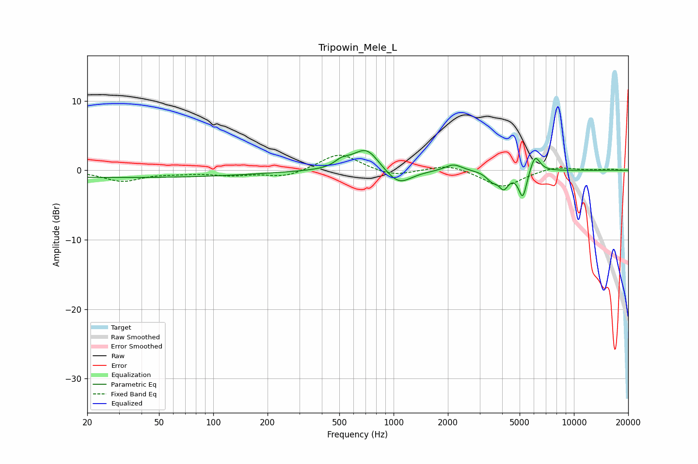

# Tripowin_Mele_L
See [usage instructions](https://github.com/jaakkopasanen/AutoEq#usage) for more options and info.

### Parametric EQs
Apply preamp of -2.9 dB when using parametric equalizer.

|   # | Type    |   Fc (Hz) |    Q |   Gain (dB) |
|-----|---------|-----------|------|-------------|
|   1 | Peaking |        32 | 0.18 |        -1   |
|   2 | Peaking |       512 | 3.81 |         0.8 |
|   3 | Peaking |       598 | 2.2  |         0.6 |
|   4 | Peaking |       713 | 2.11 |         3   |
|   5 | Peaking |      1067 | 2    |        -2.3 |
|   6 | Peaking |      2147 | 3.03 |         1   |
|   7 | Peaking |      3511 | 4.53 |        -1.2 |
|   8 | Peaking |      4078 | 5.16 |        -2.2 |
|   9 | Peaking |      5203 | 6    |        -4   |
|  10 | Peaking |      6088 | 5    |         2.5 |

### Fixed Band EQs
When using fixed band (also called graphic) equalizer, apply preamp of **-2.3 dB** (if available) and set gains manually with these parameters.

|   # | Type    |   Fc (Hz) |    Q |   Gain (dB) |
|-----|---------|-----------|------|-------------|
|   1 | Peaking |        31 | 1.41 |        -1.5 |
|   2 | Peaking |        62 | 1.41 |        -0.3 |
|   3 | Peaking |       125 | 1.41 |        -0.6 |
|   4 | Peaking |       250 | 1.41 |        -1   |
|   5 | Peaking |       500 | 1.41 |         2.5 |
|   6 | Peaking |      1000 | 1.41 |        -0.9 |
|   7 | Peaking |      2000 | 1.41 |         0.9 |
|   8 | Peaking |      4000 | 1.41 |        -2.5 |
|   9 | Peaking |      8000 | 1.41 |         0.6 |
|  10 | Peaking |     16000 | 1.41 |         0.2 |

### Graphs

