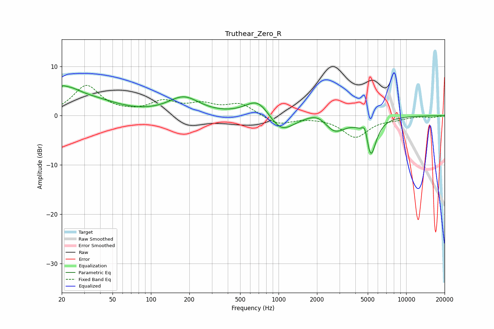

# Truthear_Zero_R
See [usage instructions](https://github.com/jaakkopasanen/AutoEq#usage) for more options and info.

### Parametric EQs
Apply preamp of -6.2 dB when using parametric equalizer.

|   # | Type    |   Fc (Hz) |    Q |   Gain (dB) |
|-----|---------|-----------|------|-------------|
|   1 | Peaking |        20 | 5.99 |         0.9 |
|   2 | Peaking |        22 | 1.36 |         3.8 |
|   3 | Peaking |        36 | 0.7  |         2.5 |
|   4 | Peaking |       181 | 1.16 |         3.5 |
|   5 | Peaking |       691 | 1.47 |         3.8 |
|   6 | Peaking |      1043 | 1.43 |        -3.8 |
|   7 | Peaking |      2075 | 1.59 |         1.9 |
|   8 | Peaking |      2717 | 1.6  |        -3.6 |
|   9 | Peaking |      4765 | 6    |         3.2 |
|  10 | Peaking |      5254 | 3.26 |        -8.4 |

### Fixed Band EQs
When using fixed band (also called graphic) equalizer, apply preamp of **-6.2 dB** (if available) and set gains manually with these parameters.

|   # | Type    |   Fc (Hz) |    Q |   Gain (dB) |
|-----|---------|-----------|------|-------------|
|   1 | Peaking |        31 | 1.41 |         6   |
|   2 | Peaking |        62 | 1.41 |         0.2 |
|   3 | Peaking |       125 | 1.41 |         2.6 |
|   4 | Peaking |       250 | 1.41 |         2   |
|   5 | Peaking |       500 | 1.41 |         2.3 |
|   6 | Peaking |      1000 | 1.41 |        -1.8 |
|   7 | Peaking |      2000 | 1.41 |        -0.1 |
|   8 | Peaking |      4000 | 1.41 |        -4.3 |
|   9 | Peaking |      8000 | 1.41 |        -0.5 |
|  10 | Peaking |     16000 | 1.41 |        -0.3 |

### Graphs

