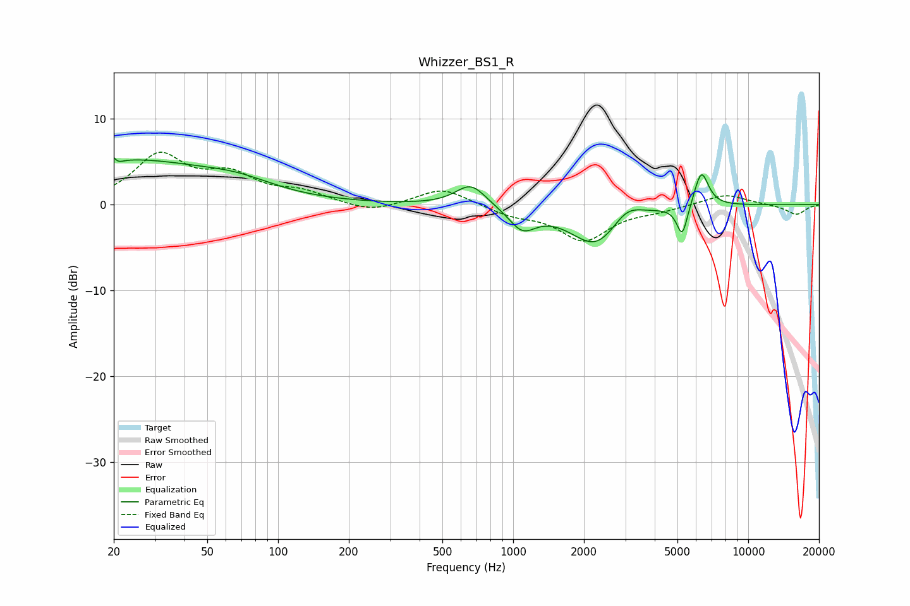

# Whizzer_BS1_R
See [usage instructions](https://github.com/jaakkopasanen/AutoEq#usage) for more options and info.

### Parametric EQs
Apply preamp of -5.6 dB when using parametric equalizer.

|   # | Type    |   Fc (Hz) |    Q |   Gain (dB) |
|-----|---------|-----------|------|-------------|
|   1 | Peaking |        20 | 5.91 |         4   |
|   2 | Peaking |        20 | 5.96 |        -3.7 |
|   3 | Peaking |        23 | 0.39 |         5   |
|   4 | Peaking |        68 | 0.91 |         1.3 |
|   5 | Peaking |       661 | 2.19 |         2.6 |
|   6 | Peaking |      1094 | 2.46 |        -2.6 |
|   7 | Peaking |      2259 | 1.29 |        -4.9 |
|   8 | Peaking |      3036 | 2.15 |         2   |
|   9 | Peaking |      5240 | 6    |        -3.7 |
|  10 | Peaking |      6318 | 4.51 |         4.2 |

### Fixed Band EQs
When using fixed band (also called graphic) equalizer, apply preamp of **-6.2 dB** (if available) and set gains manually with these parameters.

|   # | Type    |   Fc (Hz) |    Q |   Gain (dB) |
|-----|---------|-----------|------|-------------|
|   1 | Peaking |        31 | 1.41 |         5.5 |
|   2 | Peaking |        62 | 1.41 |         3   |
|   3 | Peaking |       125 | 1.41 |         1.3 |
|   4 | Peaking |       250 | 1.41 |        -1   |
|   5 | Peaking |       500 | 1.41 |         2   |
|   6 | Peaking |      1000 | 1.41 |        -1.1 |
|   7 | Peaking |      2000 | 1.41 |        -4.1 |
|   8 | Peaking |      4000 | 1.41 |        -0.5 |
|   9 | Peaking |      8000 | 1.41 |         1.3 |
|  10 | Peaking |     16000 | 1.41 |        -1.2 |

### Graphs

