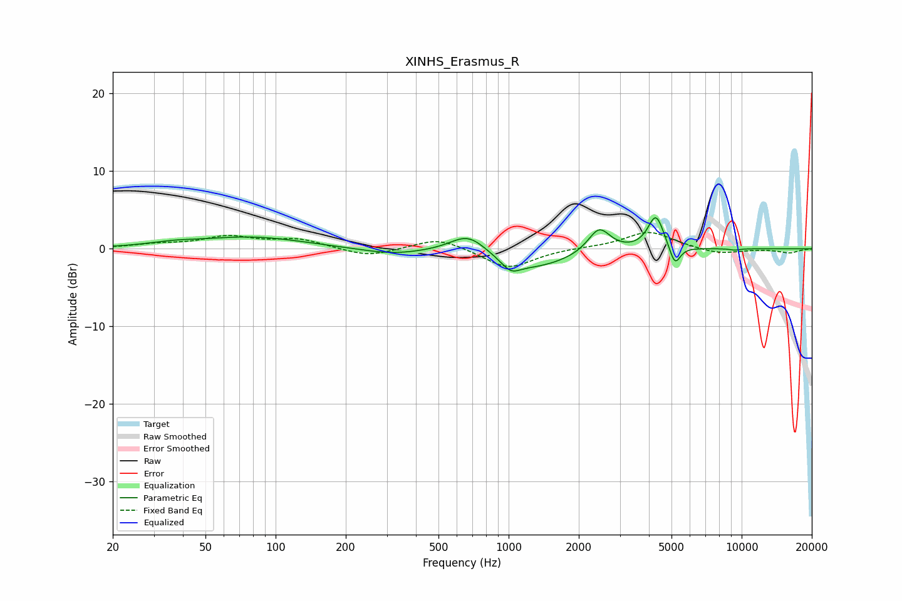

# XINHS_Erasmus_R
See [usage instructions](https://github.com/jaakkopasanen/AutoEq#usage) for more options and info.

### Parametric EQs
Apply preamp of -4.1 dB when using parametric equalizer.

|   # | Type    |   Fc (Hz) |    Q |   Gain (dB) |
|-----|---------|-----------|------|-------------|
|   1 | Peaking |        36 | 1.39 |         0.4 |
|   2 | Peaking |        79 | 0.62 |         1.5 |
|   3 | Peaking |       314 | 1.05 |        -0.7 |
|   4 | Peaking |       672 | 1.76 |         2.6 |
|   5 | Peaking |      1021 | 3.59 |        -1.4 |
|   6 | Peaking |      1245 | 0.84 |        -2.5 |
|   7 | Peaking |      2444 | 2.97 |         3.2 |
|   8 | Peaking |      4286 | 4.13 |         4.4 |
|   9 | Peaking |      5168 | 6    |        -2.6 |
|  10 | Peaking |      9329 | 6    |        -0.2 |

### Fixed Band EQs
When using fixed band (also called graphic) equalizer, apply preamp of **-2.2 dB** (if available) and set gains manually with these parameters.

|   # | Type    |   Fc (Hz) |    Q |   Gain (dB) |
|-----|---------|-----------|------|-------------|
|   1 | Peaking |        31 | 1.41 |         0.5 |
|   2 | Peaking |        62 | 1.41 |         1.4 |
|   3 | Peaking |       125 | 1.41 |         1.1 |
|   4 | Peaking |       250 | 1.41 |        -1.1 |
|   5 | Peaking |       500 | 1.41 |         1.5 |
|   6 | Peaking |      1000 | 1.41 |        -2.6 |
|   7 | Peaking |      2000 | 1.41 |         0.1 |
|   8 | Peaking |      4000 | 1.41 |         2.3 |
|   9 | Peaking |      8000 | 1.41 |        -0.7 |
|  10 | Peaking |     16000 | 1.41 |        -0.5 |

### Graphs

