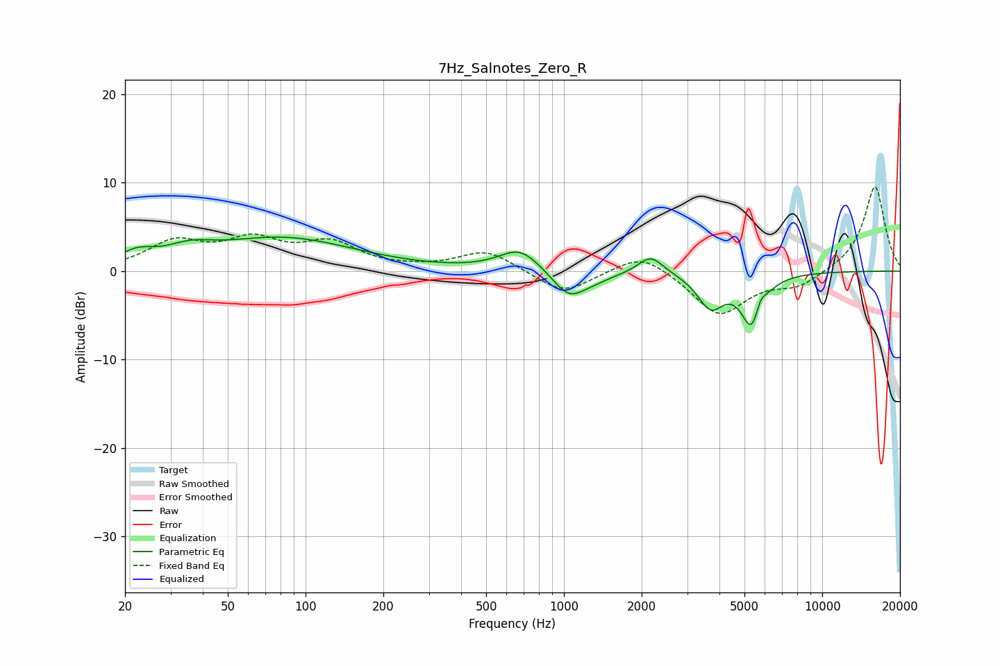

# 7Hz_Salnotes_Zero_R
See [usage instructions](https://github.com/jaakkopasanen/AutoEq#usage) for more options and info.

### Parametric EQs
Apply preamp of -3.9 dB when using parametric equalizer.

|   # | Type    |   Fc (Hz) |    Q |   Gain (dB) |
|-----|---------|-----------|------|-------------|
|   1 | Peaking |        22 | 2.18 |         1.4 |
|   2 | Peaking |        36 | 1.58 |         1.3 |
|   3 | Peaking |        82 | 0.51 |         3.6 |
|   4 | Peaking |       674 | 1.79 |         2.5 |
|   5 | Peaking |      1038 | 2.32 |        -2.7 |
|   6 | Peaking |      1258 | 1.69 |        -0.9 |
|   7 | Peaking |      2168 | 2.89 |         2.1 |
|   8 | Peaking |      3699 | 2.75 |        -3.8 |
|   9 | Peaking |      5385 | 3.31 |        -6.6 |
|  10 | Peaking |      5726 | 5.86 |         2.3 |

### Fixed Band EQs
When using fixed band (also called graphic) equalizer, apply preamp of **-9.6 dB** (if available) and set gains manually with these parameters.

|   # | Type    |   Fc (Hz) |    Q |   Gain (dB) |
|-----|---------|-----------|------|-------------|
|   1 | Peaking |        31 | 1.41 |         3   |
|   2 | Peaking |        62 | 1.41 |         3.1 |
|   3 | Peaking |       125 | 1.41 |         2.9 |
|   4 | Peaking |       250 | 1.41 |         0.1 |
|   5 | Peaking |       500 | 1.41 |         2.3 |
|   6 | Peaking |      1000 | 1.41 |        -2.6 |
|   7 | Peaking |      2000 | 1.41 |         2.3 |
|   8 | Peaking |      4000 | 1.41 |        -5   |
|   9 | Peaking |      8000 | 1.41 |        -1.6 |
|  10 | Peaking |     16000 | 1.41 |         9.7 |

### Graphs

