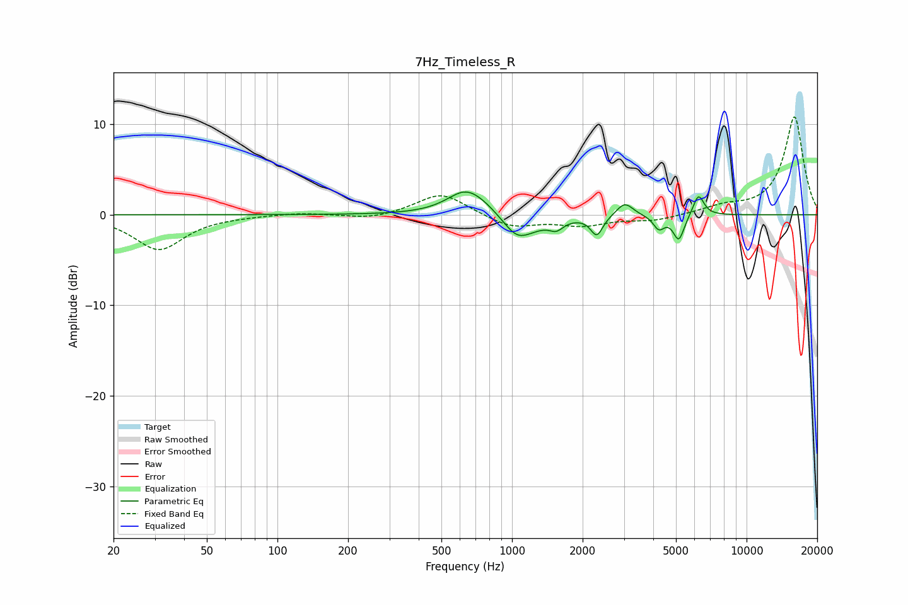

# 7Hz_Timeless_R
See [usage instructions](https://github.com/jaakkopasanen/AutoEq#usage) for more options and info.

### Parametric EQs
Apply preamp of -2.6 dB when using parametric equalizer.

|   # | Type    |   Fc (Hz) |    Q |   Gain (dB) |
|-----|---------|-----------|------|-------------|
|   1 | Peaking |       633 | 1.8  |         2.4 |
|   2 | Peaking |       779 | 1.48 |         1.2 |
|   3 | Peaking |      1044 | 3.39 |        -0.6 |
|   4 | Peaking |      1069 | 1.56 |        -2.7 |
|   5 | Peaking |      1546 | 4.88 |        -0.9 |
|   6 | Peaking |      2298 | 5.52 |        -2.2 |
|   7 | Peaking |      3025 | 4.02 |         1.5 |
|   8 | Peaking |      4227 | 6    |        -1.5 |
|   9 | Peaking |      5140 | 6    |        -2.8 |
|  10 | Peaking |      6238 | 5.98 |         2.4 |

### Fixed Band EQs
When using fixed band (also called graphic) equalizer, apply preamp of **-10.9 dB** (if available) and set gains manually with these parameters.

|   # | Type    |   Fc (Hz) |    Q |   Gain (dB) |
|-----|---------|-----------|------|-------------|
|   1 | Peaking |        31 | 1.41 |        -3.8 |
|   2 | Peaking |        62 | 1.41 |        -0.1 |
|   3 | Peaking |       125 | 1.41 |         0.3 |
|   4 | Peaking |       250 | 1.41 |        -0.5 |
|   5 | Peaking |       500 | 1.41 |         2.5 |
|   6 | Peaking |      1000 | 1.41 |        -1.4 |
|   7 | Peaking |      2000 | 1.41 |        -1.1 |
|   8 | Peaking |      4000 | 1.41 |        -0.6 |
|   9 | Peaking |      8000 | 1.41 |         0.8 |
|  10 | Peaking |     16000 | 1.41 |        10.8 |

### Graphs

