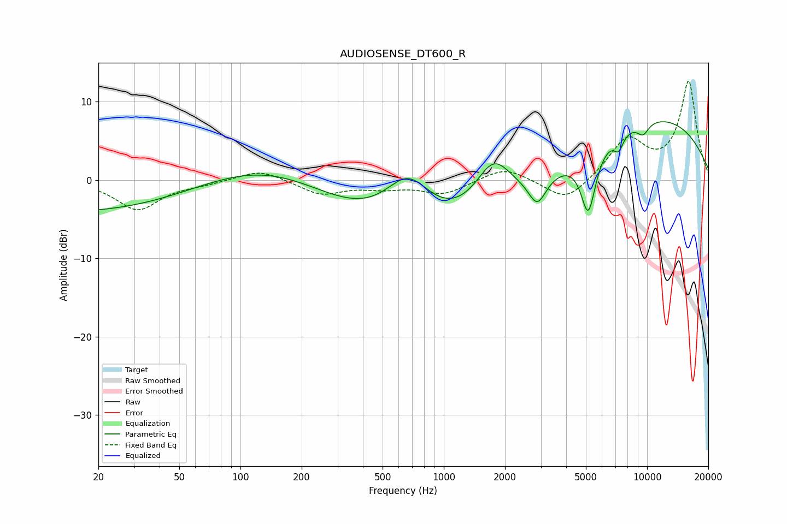

# AUDIOSENSE_DT600_R
See [usage instructions](https://github.com/jaakkopasanen/AutoEq#usage) for more options and info.

### Parametric EQs
Apply preamp of -7.5 dB when using parametric equalizer.

|   # | Type    |   Fc (Hz) |    Q |   Gain (dB) |
|-----|---------|-----------|------|-------------|
|   1 | Peaking |        21 | 0.2  |        -4.4 |
|   2 | Peaking |       149 | 0.38 |         5.7 |
|   3 | Peaking |       668 | 1.18 |         6.8 |
|   4 | Peaking |       702 | 0.24 |        -9   |
|   5 | Peaking |      1754 | 1.52 |         6.4 |
|   6 | Peaking |      2885 | 3.26 |        -3.6 |
|   7 | Peaking |      5139 | 3.69 |        -8.2 |
|   8 | Peaking |      7245 | 5.55 |        -2   |
|   9 | Peaking |      9547 | 4.16 |        -1.6 |
|  10 | Peaking |     10000 | 0.29 |         8.2 |

### Fixed Band EQs
When using fixed band (also called graphic) equalizer, apply preamp of **-12.7 dB** (if available) and set gains manually with these parameters.

|   # | Type    |   Fc (Hz) |    Q |   Gain (dB) |
|-----|---------|-----------|------|-------------|
|   1 | Peaking |        31 | 1.41 |        -3.8 |
|   2 | Peaking |        62 | 1.41 |        -0.4 |
|   3 | Peaking |       125 | 1.41 |         1.4 |
|   4 | Peaking |       250 | 1.41 |        -1.8 |
|   5 | Peaking |       500 | 1.41 |        -0.9 |
|   6 | Peaking |      1000 | 1.41 |        -1.8 |
|   7 | Peaking |      2000 | 1.41 |         1.7 |
|   8 | Peaking |      4000 | 1.41 |        -3   |
|   9 | Peaking |      8000 | 1.41 |         5   |
|  10 | Peaking |     16000 | 1.41 |        12.5 |

### Graphs

