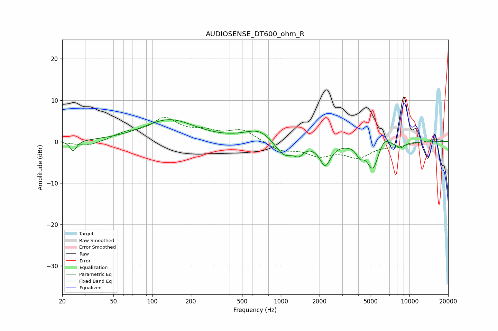

# AUDIOSENSE_DT600_ohm_R
See [usage instructions](https://github.com/jaakkopasanen/AutoEq#usage) for more options and info.

### Parametric EQs
Apply preamp of -5.4 dB when using parametric equalizer.

|   # | Type    |   Fc (Hz) |    Q |   Gain (dB) |
|-----|---------|-----------|------|-------------|
|   1 | Peaking |        24 | 5.69 |        -2.6 |
|   2 | Peaking |       136 | 0.7  |         5.2 |
|   3 | Peaking |       695 | 1.21 |         3.2 |
|   4 | Peaking |      1060 | 1.79 |        -4.4 |
|   5 | Peaking |      1381 | 4.38 |        -1.8 |
|   6 | Peaking |      2213 | 3.36 |        -5.3 |
|   7 | Peaking |      4120 | 5.12 |        -2.2 |
|   8 | Peaking |      5193 | 3.03 |        -6.7 |
|   9 | Peaking |      6334 | 3.35 |         2.4 |
|  10 | Peaking |      8505 | 4.07 |        -1.3 |

### Fixed Band EQs
When using fixed band (also called graphic) equalizer, apply preamp of **-5.9 dB** (if available) and set gains manually with these parameters.

|   # | Type    |   Fc (Hz) |    Q |   Gain (dB) |
|-----|---------|-----------|------|-------------|
|   1 | Peaking |        31 | 1.41 |        -1.3 |
|   2 | Peaking |        62 | 1.41 |         1.7 |
|   3 | Peaking |       125 | 1.41 |         5.1 |
|   4 | Peaking |       250 | 1.41 |         2   |
|   5 | Peaking |       500 | 1.41 |         2.8 |
|   6 | Peaking |      1000 | 1.41 |        -2.1 |
|   7 | Peaking |      2000 | 1.41 |        -2.9 |
|   8 | Peaking |      4000 | 1.41 |        -3.4 |
|   9 | Peaking |      8000 | 1.41 |        -0.8 |
|  10 | Peaking |     16000 | 1.41 |         0.7 |

### Graphs

