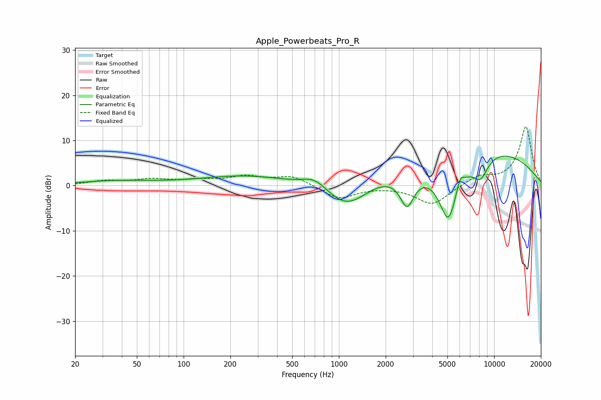

# Apple_Powerbeats_Pro_R
See [usage instructions](https://github.com/jaakkopasanen/AutoEq#usage) for more options and info.

### Parametric EQs
Apply preamp of -6.6 dB when using parametric equalizer.

|   # | Type    |   Fc (Hz) |    Q |   Gain (dB) |
|-----|---------|-----------|------|-------------|
|   1 | Peaking |        35 | 0.65 |         0.9 |
|   2 | Peaking |        71 | 0.56 |         0.2 |
|   3 | Peaking |       254 | 0.5  |         2.1 |
|   4 | Peaking |       700 | 1.75 |         2.5 |
|   5 | Peaking |      1126 | 0.99 |        -6.3 |
|   6 | Peaking |      2748 | 2.95 |        -7.4 |
|   7 | Peaking |      5061 | 1.91 |       -15.1 |
|   8 | Peaking |      6049 | 6    |         2.6 |
|   9 | Peaking |      7080 | 0.27 |         9.5 |
|  10 | Peaking |      8167 | 2.62 |        -4.7 |

### Fixed Band EQs
When using fixed band (also called graphic) equalizer, apply preamp of **-13.1 dB** (if available) and set gains manually with these parameters.

|   # | Type    |   Fc (Hz) |    Q |   Gain (dB) |
|-----|---------|-----------|------|-------------|
|   1 | Peaking |        31 | 1.41 |         0.9 |
|   2 | Peaking |        62 | 1.41 |         1.2 |
|   3 | Peaking |       125 | 1.41 |         1   |
|   4 | Peaking |       250 | 1.41 |         1.8 |
|   5 | Peaking |       500 | 1.41 |         2.1 |
|   6 | Peaking |      1000 | 1.41 |        -3   |
|   7 | Peaking |      2000 | 1.41 |        -0   |
|   8 | Peaking |      4000 | 1.41 |        -4.3 |
|   9 | Peaking |      8000 | 1.41 |         2   |
|  10 | Peaking |     16000 | 1.41 |        13.1 |

### Graphs

