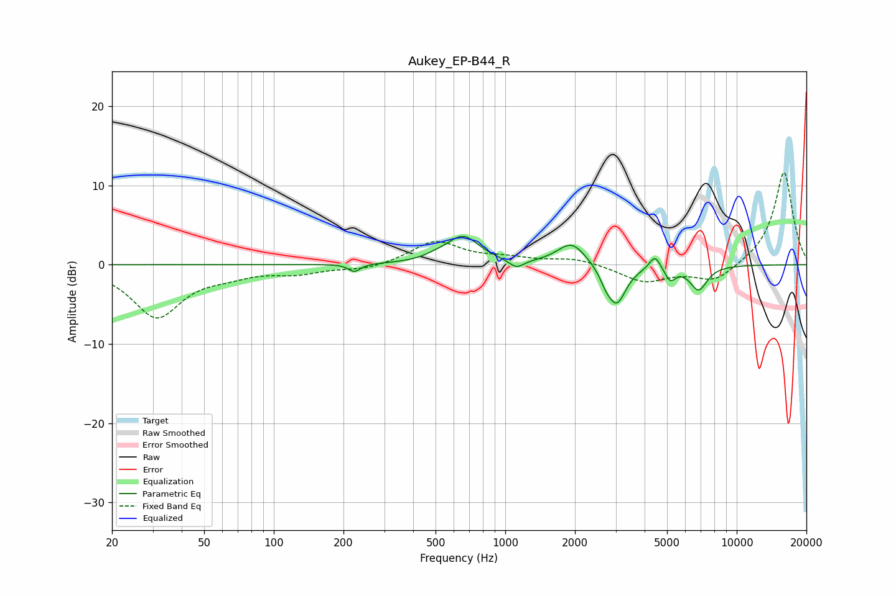

# Aukey_EP-B44_R
See [usage instructions](https://github.com/jaakkopasanen/AutoEq#usage) for more options and info.

### Parametric EQs
Apply preamp of -3.7 dB when using parametric equalizer.

|   # | Type    |   Fc (Hz) |    Q |   Gain (dB) |
|-----|---------|-----------|------|-------------|
|   1 | Peaking |       223 | 5.62 |        -1   |
|   2 | Peaking |       500 | 2.66 |         0.4 |
|   3 | Peaking |       657 | 2    |         3.4 |
|   4 | Peaking |      1118 | 4.39 |        -1.1 |
|   5 | Peaking |      1938 | 2.28 |         2.9 |
|   6 | Peaking |      2723 | 5.37 |        -1.2 |
|   7 | Peaking |      3032 | 3.44 |        -4.9 |
|   8 | Peaking |      4437 | 5.97 |         1.8 |
|   9 | Peaking |      5163 | 6    |        -1.7 |
|  10 | Peaking |      6841 | 3.6  |        -3.1 |

### Fixed Band EQs
When using fixed band (also called graphic) equalizer, apply preamp of **-11.7 dB** (if available) and set gains manually with these parameters.

|   # | Type    |   Fc (Hz) |    Q |   Gain (dB) |
|-----|---------|-----------|------|-------------|
|   1 | Peaking |        31 | 1.41 |        -6.5 |
|   2 | Peaking |        62 | 1.41 |        -0.9 |
|   3 | Peaking |       125 | 1.41 |        -1   |
|   4 | Peaking |       250 | 1.41 |        -0.6 |
|   5 | Peaking |       500 | 1.41 |         2.9 |
|   6 | Peaking |      1000 | 1.41 |         0.7 |
|   7 | Peaking |      2000 | 1.41 |         0.8 |
|   8 | Peaking |      4000 | 1.41 |        -2.1 |
|   9 | Peaking |      8000 | 1.41 |        -2.2 |
|  10 | Peaking |     16000 | 1.41 |        11.8 |

### Graphs

