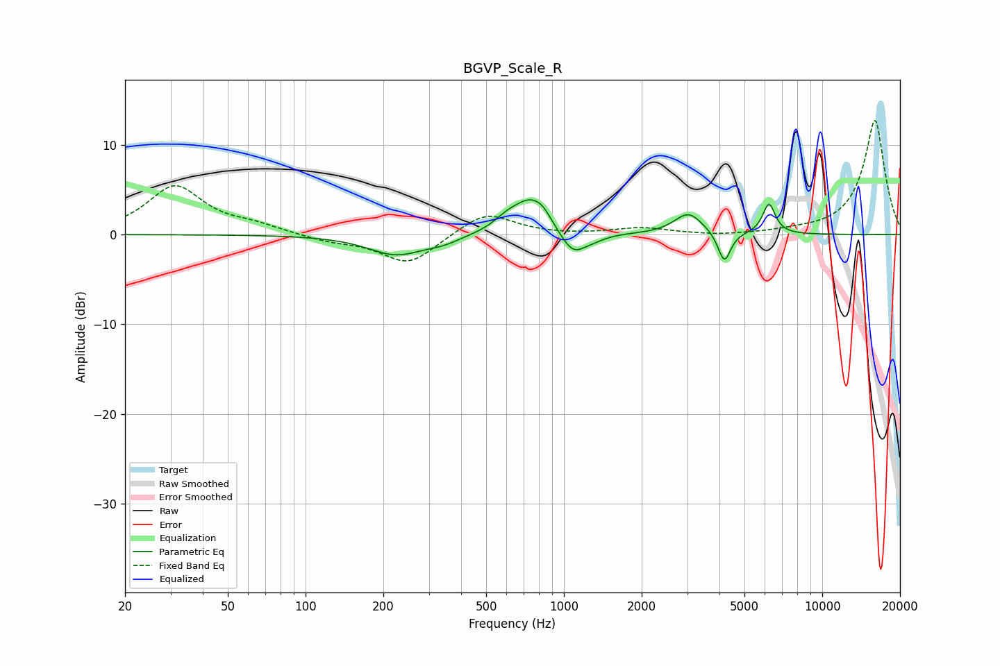

# BGVP_Scale_R
See [usage instructions](https://github.com/jaakkopasanen/AutoEq#usage) for more options and info.

### Parametric EQs
Apply preamp of -4.0 dB when using parametric equalizer.

|   # | Type    |   Fc (Hz) |    Q |   Gain (dB) |
|-----|---------|-----------|------|-------------|
|   1 | Peaking |       225 | 1.29 |        -2.2 |
|   2 | Peaking |       343 | 2.18 |        -0.6 |
|   3 | Peaking |       600 | 2.89 |         0.9 |
|   4 | Peaking |       752 | 1.96 |         4   |
|   5 | Peaking |       832 | 5.36 |         0.5 |
|   6 | Peaking |      1083 | 2.72 |        -2.8 |
|   7 | Peaking |      1325 | 3.13 |        -0.4 |
|   8 | Peaking |      3037 | 2.6  |         2.4 |
|   9 | Peaking |      4178 | 5.78 |        -3.5 |
|  10 | Peaking |      6222 | 5.68 |         3.4 |

### Fixed Band EQs
When using fixed band (also called graphic) equalizer, apply preamp of **-12.8 dB** (if available) and set gains manually with these parameters.

|   # | Type    |   Fc (Hz) |    Q |   Gain (dB) |
|-----|---------|-----------|------|-------------|
|   1 | Peaking |        31 | 1.41 |         5.3 |
|   2 | Peaking |        62 | 1.41 |         0.8 |
|   3 | Peaking |       125 | 1.41 |        -0.7 |
|   4 | Peaking |       250 | 1.41 |        -3.3 |
|   5 | Peaking |       500 | 1.41 |         2.6 |
|   6 | Peaking |      1000 | 1.41 |        -0.1 |
|   7 | Peaking |      2000 | 1.41 |         0.7 |
|   8 | Peaking |      4000 | 1.41 |        -0.2 |
|   9 | Peaking |      8000 | 1.41 |         0.2 |
|  10 | Peaking |     16000 | 1.41 |        12.8 |

### Graphs

