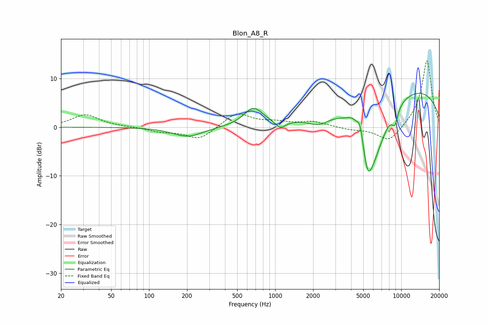

# Blon_A8_R
See [usage instructions](https://github.com/jaakkopasanen/AutoEq#usage) for more options and info.

### Parametric EQs
Apply preamp of -7.0 dB when using parametric equalizer.

|   # | Type    |   Fc (Hz) |    Q |   Gain (dB) |
|-----|---------|-----------|------|-------------|
|   1 | Peaking |       202 | 1.22 |        -2   |
|   2 | Peaking |       672 | 1.85 |         3.7 |
|   3 | Peaking |      1101 | 3.53 |        -1.6 |
|   4 | Peaking |      2202 | 1.74 |        -1.7 |
|   5 | Peaking |      4165 | 2.83 |         1.7 |
|   6 | Peaking |      4716 | 6    |         3.2 |
|   7 | Peaking |      5419 | 3.49 |        -6.8 |
|   8 | Peaking |      6068 | 1.21 |       -11.8 |
|   9 | Peaking |      8907 | 5.61 |        -2.9 |
|  10 | Peaking |     10000 | 0.23 |         8.8 |

### Fixed Band EQs
When using fixed band (also called graphic) equalizer, apply preamp of **-13.7 dB** (if available) and set gains manually with these parameters.

|   # | Type    |   Fc (Hz) |    Q |   Gain (dB) |
|-----|---------|-----------|------|-------------|
|   1 | Peaking |        31 | 1.41 |         2.6 |
|   2 | Peaking |        62 | 1.41 |         0.1 |
|   3 | Peaking |       125 | 1.41 |        -0.8 |
|   4 | Peaking |       250 | 1.41 |        -2.6 |
|   5 | Peaking |       500 | 1.41 |         3   |
|   6 | Peaking |      1000 | 1.41 |         0.8 |
|   7 | Peaking |      2000 | 1.41 |         1.1 |
|   8 | Peaking |      4000 | 1.41 |        -0.5 |
|   9 | Peaking |      8000 | 1.41 |        -3.3 |
|  10 | Peaking |     16000 | 1.41 |        13.9 |

### Graphs

