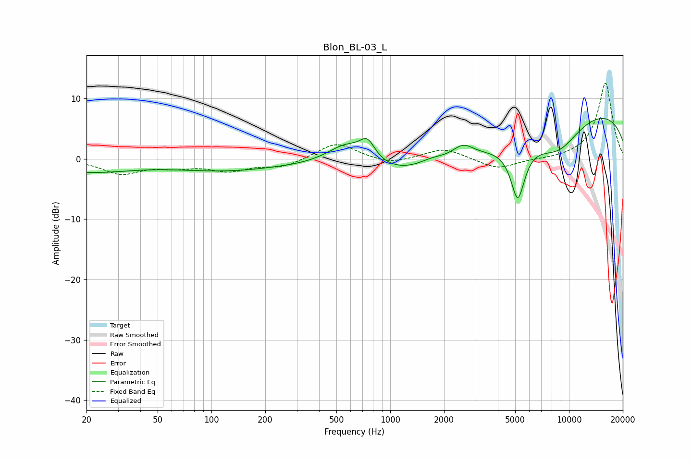

# Blon_BL-03_L
See [usage instructions](https://github.com/jaakkopasanen/AutoEq#usage) for more options and info.

### Parametric EQs
Apply preamp of -6.8 dB when using parametric equalizer.

|   # | Type    |   Fc (Hz) |    Q |   Gain (dB) |
|-----|---------|-----------|------|-------------|
|   1 | Peaking |        20 | 0.55 |        -2.1 |
|   2 | Peaking |       119 | 0.49 |        -1.8 |
|   3 | Peaking |       570 | 1.23 |         4.1 |
|   4 | Peaking |       746 | 3.28 |         3.1 |
|   5 | Peaking |      1718 | 1.65 |         1.4 |
|   6 | Peaking |      2003 | 0.29 |        -5.4 |
|   7 | Peaking |      2550 | 2.32 |         2.3 |
|   8 | Peaking |      5170 | 3.46 |        -9   |
|   9 | Peaking |      8693 | 0.99 |        -5.1 |
|  10 | Peaking |     10000 | 0.18 |         8.8 |

### Fixed Band EQs
When using fixed band (also called graphic) equalizer, apply preamp of **-12.6 dB** (if available) and set gains manually with these parameters.

|   # | Type    |   Fc (Hz) |    Q |   Gain (dB) |
|-----|---------|-----------|------|-------------|
|   1 | Peaking |        31 | 1.41 |        -2.4 |
|   2 | Peaking |        62 | 1.41 |        -1.1 |
|   3 | Peaking |       125 | 1.41 |        -1.8 |
|   4 | Peaking |       250 | 1.41 |        -1.3 |
|   5 | Peaking |       500 | 1.41 |         2.8 |
|   6 | Peaking |      1000 | 1.41 |        -1   |
|   7 | Peaking |      2000 | 1.41 |         1.8 |
|   8 | Peaking |      4000 | 1.41 |        -1.8 |
|   9 | Peaking |      8000 | 1.41 |        -0.1 |
|  10 | Peaking |     16000 | 1.41 |        12.6 |

### Graphs

