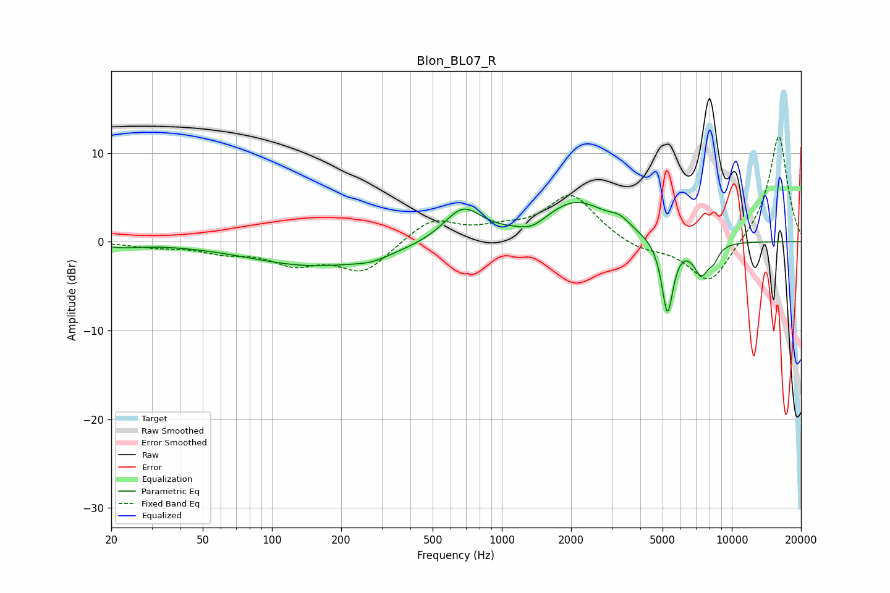

# Blon_BL07_R
See [usage instructions](https://github.com/jaakkopasanen/AutoEq#usage) for more options and info.

### Parametric EQs
Apply preamp of -4.5 dB when using parametric equalizer.

|   # | Type    |   Fc (Hz) |    Q |   Gain (dB) |
|-----|---------|-----------|------|-------------|
|   1 | Peaking |        22 | 1.75 |        -0.5 |
|   2 | Peaking |       154 | 0.49 |        -2.7 |
|   3 | Peaking |       272 | 1.83 |        -0.6 |
|   4 | Peaking |       676 | 1.7  |         3.7 |
|   5 | Peaking |      1352 | 2.44 |        -1   |
|   6 | Peaking |      2104 | 0.98 |         4.5 |
|   7 | Peaking |      3262 | 3.43 |         0.9 |
|   8 | Peaking |      5250 | 5.49 |        -8.4 |
|   9 | Peaking |      7373 | 3.81 |        -3.5 |
|  10 | Peaking |      8359 | 6    |        -1.2 |

### Fixed Band EQs
When using fixed band (also called graphic) equalizer, apply preamp of **-11.9 dB** (if available) and set gains manually with these parameters.

|   # | Type    |   Fc (Hz) |    Q |   Gain (dB) |
|-----|---------|-----------|------|-------------|
|   1 | Peaking |        31 | 1.41 |        -0.5 |
|   2 | Peaking |        62 | 1.41 |        -1   |
|   3 | Peaking |       125 | 1.41 |        -2.2 |
|   4 | Peaking |       250 | 1.41 |        -3.3 |
|   5 | Peaking |       500 | 1.41 |         2.6 |
|   6 | Peaking |      1000 | 1.41 |         1   |
|   7 | Peaking |      2000 | 1.41 |         5.2 |
|   8 | Peaking |      4000 | 1.41 |        -1   |
|   9 | Peaking |      8000 | 1.41 |        -5   |
|  10 | Peaking |     16000 | 1.41 |        12.2 |

### Graphs

