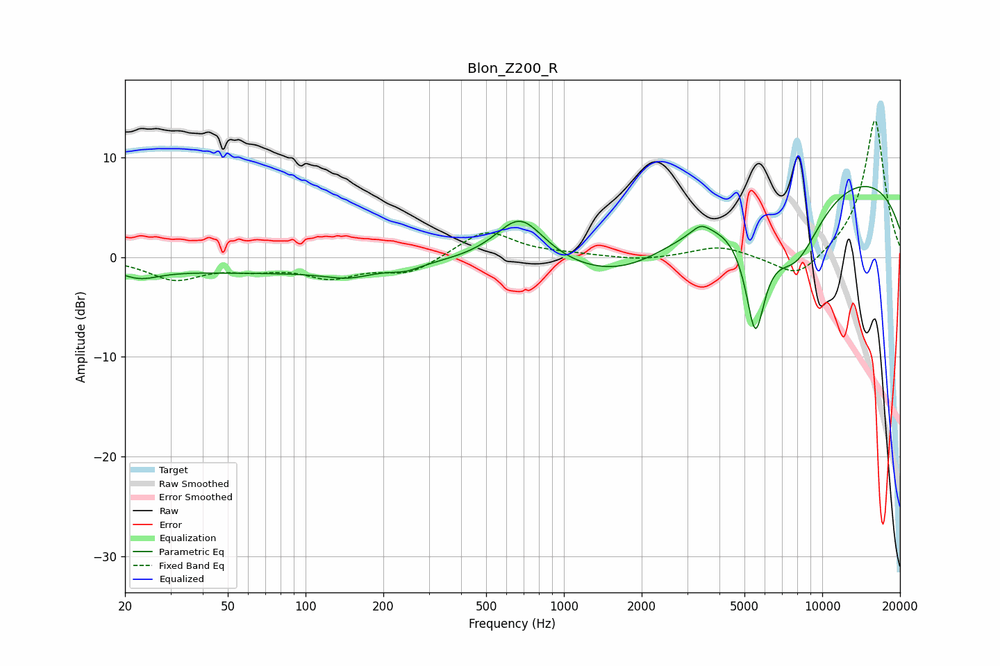

# Blon_Z200_R
See [usage instructions](https://github.com/jaakkopasanen/AutoEq#usage) for more options and info.

### Parametric EQs
Apply preamp of -7.2 dB when using parametric equalizer.

|   # | Type    |   Fc (Hz) |    Q |   Gain (dB) |
|-----|---------|-----------|------|-------------|
|   1 | Peaking |        23 | 1.82 |        -1.1 |
|   2 | Peaking |        68 | 0.26 |        -1.5 |
|   3 | Peaking |       147 | 1.54 |        -0.8 |
|   4 | Peaking |       245 | 2.52 |        -0.5 |
|   5 | Peaking |       677 | 1.5  |         4.7 |
|   6 | Peaking |      1762 | 0.58 |        -4.5 |
|   7 | Peaking |      3381 | 4    |         0.9 |
|   8 | Peaking |      5506 | 3.46 |       -10.6 |
|   9 | Peaking |      7862 | 1.17 |        -7.7 |
|  10 | Peaking |      9598 | 0.19 |         9.1 |

### Fixed Band EQs
When using fixed band (also called graphic) equalizer, apply preamp of **-13.8 dB** (if available) and set gains manually with these parameters.

|   # | Type    |   Fc (Hz) |    Q |   Gain (dB) |
|-----|---------|-----------|------|-------------|
|   1 | Peaking |        31 | 1.41 |        -2.1 |
|   2 | Peaking |        62 | 1.41 |        -0.9 |
|   3 | Peaking |       125 | 1.41 |        -1.8 |
|   4 | Peaking |       250 | 1.41 |        -1.6 |
|   5 | Peaking |       500 | 1.41 |         2.8 |
|   6 | Peaking |      1000 | 1.41 |         0.2 |
|   7 | Peaking |      2000 | 1.41 |        -0.4 |
|   8 | Peaking |      4000 | 1.41 |         1.1 |
|   9 | Peaking |      8000 | 1.41 |        -2.4 |
|  10 | Peaking |     16000 | 1.41 |        13.9 |

### Graphs

