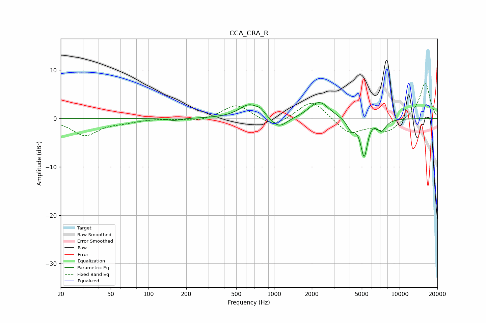

# CCA_CRA_R
See [usage instructions](https://github.com/jaakkopasanen/AutoEq#usage) for more options and info.

### Parametric EQs
Apply preamp of -3.4 dB when using parametric equalizer.

|   # | Type    |   Fc (Hz) |    Q |   Gain (dB) |
|-----|---------|-----------|------|-------------|
|   1 | Peaking |       159 | 2.96 |        -0.5 |
|   2 | Peaking |       638 | 1.72 |         2.9 |
|   3 | Peaking |       782 | 4.82 |         0.8 |
|   4 | Peaking |      1093 | 2.21 |        -2.4 |
|   5 | Peaking |      2040 | 2.25 |         0.7 |
|   6 | Peaking |      2339 | 1.92 |         3   |
|   7 | Peaking |      4109 | 4.34 |        -2.1 |
|   8 | Peaking |      5225 | 4.87 |        -8.1 |
|   9 | Peaking |      5723 | 2.83 |         0.8 |
|  10 | Peaking |      7167 | 3.72 |        -2.3 |

### Fixed Band EQs
When using fixed band (also called graphic) equalizer, apply preamp of **-7.4 dB** (if available) and set gains manually with these parameters.

|   # | Type    |   Fc (Hz) |    Q |   Gain (dB) |
|-----|---------|-----------|------|-------------|
|   1 | Peaking |        31 | 1.41 |        -3.4 |
|   2 | Peaking |        62 | 1.41 |        -0.6 |
|   3 | Peaking |       125 | 1.41 |         0   |
|   4 | Peaking |       250 | 1.41 |        -0.7 |
|   5 | Peaking |       500 | 1.41 |         3   |
|   6 | Peaking |      1000 | 1.41 |        -1.9 |
|   7 | Peaking |      2000 | 1.41 |         4   |
|   8 | Peaking |      4000 | 1.41 |        -3.2 |
|   9 | Peaking |      8000 | 1.41 |        -2.7 |
|  10 | Peaking |     16000 | 1.41 |         7.5 |

### Graphs

