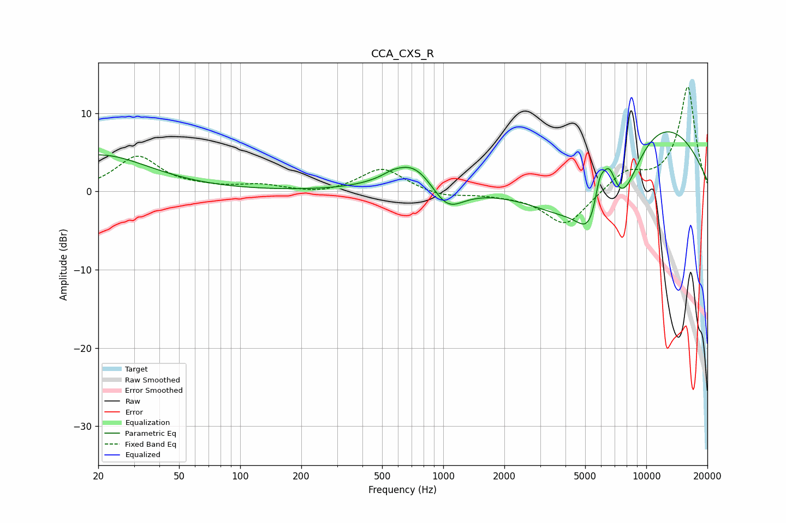

# CCA_CXS_R
See [usage instructions](https://github.com/jaakkopasanen/AutoEq#usage) for more options and info.

### Parametric EQs
Apply preamp of -7.7 dB when using parametric equalizer.

|   # | Type    |   Fc (Hz) |    Q |   Gain (dB) |
|-----|---------|-----------|------|-------------|
|   1 | Peaking |        20 | 0.57 |         4.7 |
|   2 | Peaking |       557 | 4.02 |         0.3 |
|   3 | Peaking |       714 | 1.19 |         4.1 |
|   4 | Peaking |      1040 | 1.74 |        -3.5 |
|   5 | Peaking |      4013 | 0.69 |        -6.1 |
|   6 | Peaking |      5307 | 2.08 |        -5.2 |
|   7 | Peaking |      5888 | 5.52 |         3.5 |
|   8 | Peaking |      6542 | 3.54 |         5   |
|   9 | Peaking |      7565 | 1.42 |        -7.4 |
|  10 | Peaking |      9988 | 0.35 |        10.4 |

### Fixed Band EQs
When using fixed band (also called graphic) equalizer, apply preamp of **-13.4 dB** (if available) and set gains manually with these parameters.

|   # | Type    |   Fc (Hz) |    Q |   Gain (dB) |
|-----|---------|-----------|------|-------------|
|   1 | Peaking |        31 | 1.41 |         4.4 |
|   2 | Peaking |        62 | 1.41 |         0.3 |
|   3 | Peaking |       125 | 1.41 |         0.7 |
|   4 | Peaking |       250 | 1.41 |        -0.4 |
|   5 | Peaking |       500 | 1.41 |         3   |
|   6 | Peaking |      1000 | 1.41 |        -0.7 |
|   7 | Peaking |      2000 | 1.41 |        -0.3 |
|   8 | Peaking |      4000 | 1.41 |        -4.5 |
|   9 | Peaking |      8000 | 1.41 |         2.4 |
|  10 | Peaking |     16000 | 1.41 |        13.4 |

### Graphs

