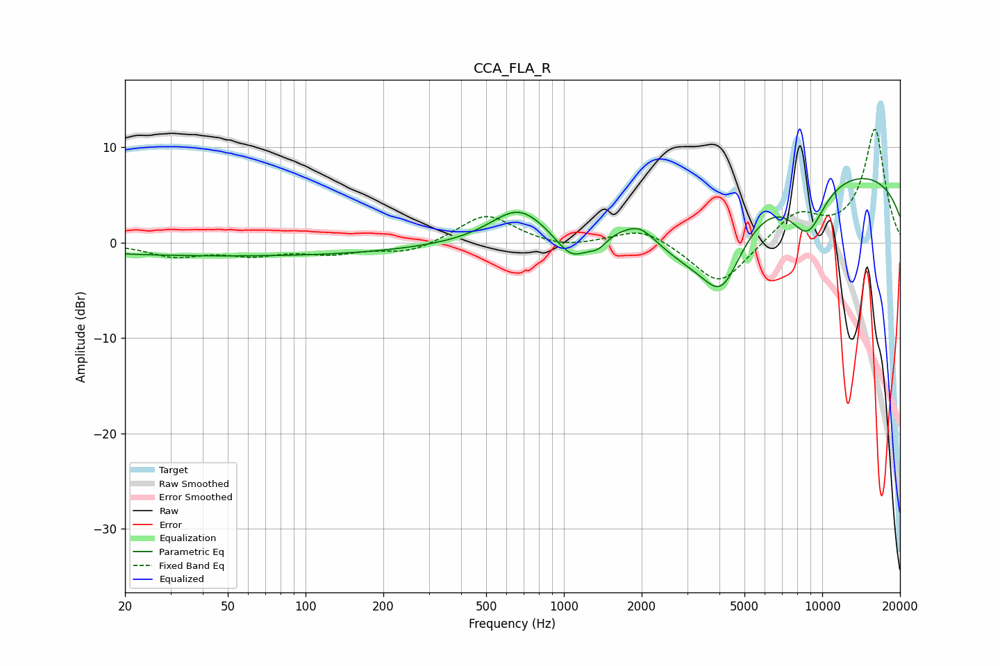

# CCA_FLA_R
See [usage instructions](https://github.com/jaakkopasanen/AutoEq#usage) for more options and info.

### Parametric EQs
Apply preamp of -6.8 dB when using parametric equalizer.

|   # | Type    |   Fc (Hz) |    Q |   Gain (dB) |
|-----|---------|-----------|------|-------------|
|   1 | Peaking |        54 | 0.18 |        -1.4 |
|   2 | Peaking |       665 | 1.34 |         3.4 |
|   3 | Peaking |      1076 | 2.11 |        -3.2 |
|   4 | Peaking |      1356 | 3.79 |        -1.3 |
|   5 | Peaking |      1599 | 0.85 |         1   |
|   6 | Peaking |      1973 | 2.57 |         1.2 |
|   7 | Peaking |      2943 | 0.89 |        -4.9 |
|   8 | Peaking |      4088 | 1.67 |        -7.2 |
|   9 | Peaking |      8774 | 1.81 |        -5.4 |
|  10 | Peaking |      9970 | 0.18 |         7.9 |

### Fixed Band EQs
When using fixed band (also called graphic) equalizer, apply preamp of **-12.0 dB** (if available) and set gains manually with these parameters.

|   # | Type    |   Fc (Hz) |    Q |   Gain (dB) |
|-----|---------|-----------|------|-------------|
|   1 | Peaking |        31 | 1.41 |        -1.3 |
|   2 | Peaking |        62 | 1.41 |        -1.1 |
|   3 | Peaking |       125 | 1.41 |        -1   |
|   4 | Peaking |       250 | 1.41 |        -1.1 |
|   5 | Peaking |       500 | 1.41 |         3.1 |
|   6 | Peaking |      1000 | 1.41 |        -0.6 |
|   7 | Peaking |      2000 | 1.41 |         1.7 |
|   8 | Peaking |      4000 | 1.41 |        -4.7 |
|   9 | Peaking |      8000 | 1.41 |         3   |
|  10 | Peaking |     16000 | 1.41 |        11.9 |

### Graphs

