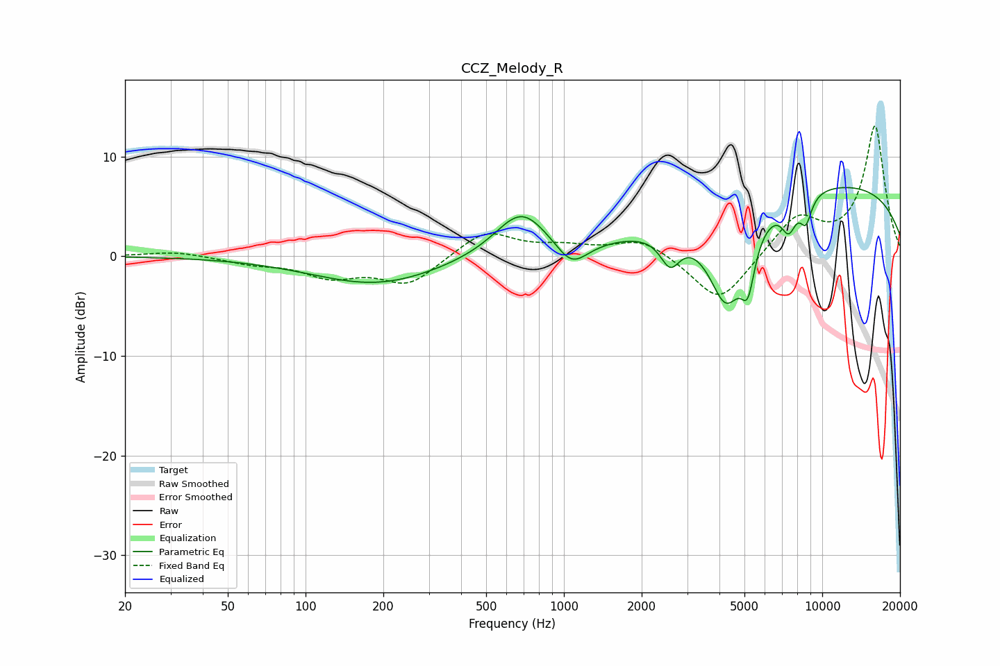

# CCZ_Melody_R
See [usage instructions](https://github.com/jaakkopasanen/AutoEq#usage) for more options and info.

### Parametric EQs
Apply preamp of -7.0 dB when using parametric equalizer.

|   # | Type    |   Fc (Hz) |    Q |   Gain (dB) |
|-----|---------|-----------|------|-------------|
|   1 | Peaking |       188 | 0.57 |        -2.8 |
|   2 | Peaking |       684 | 1.39 |         4.6 |
|   3 | Peaking |      1072 | 2.23 |        -2.7 |
|   4 | Peaking |      2579 | 3.66 |        -3.1 |
|   5 | Peaking |      4246 | 1.91 |        -9.4 |
|   6 | Peaking |      5104 | 3.9  |        -1.2 |
|   7 | Peaking |      5163 | 5.67 |        -3.5 |
|   8 | Peaking |      7418 | 4.7  |        -2.8 |
|   9 | Peaking |      8644 | 5.64 |        -2.6 |
|  10 | Peaking |     10000 | 0.21 |         7.4 |

### Fixed Band EQs
When using fixed band (also called graphic) equalizer, apply preamp of **-13.1 dB** (if available) and set gains manually with these parameters.

|   # | Type    |   Fc (Hz) |    Q |   Gain (dB) |
|-----|---------|-----------|------|-------------|
|   1 | Peaking |        31 | 1.41 |         0.5 |
|   2 | Peaking |        62 | 1.41 |        -0.6 |
|   3 | Peaking |       125 | 1.41 |        -1.9 |
|   4 | Peaking |       250 | 1.41 |        -2.8 |
|   5 | Peaking |       500 | 1.41 |         2.6 |
|   6 | Peaking |      1000 | 1.41 |         0.8 |
|   7 | Peaking |      2000 | 1.41 |         1.8 |
|   8 | Peaking |      4000 | 1.41 |        -4.9 |
|   9 | Peaking |      8000 | 1.41 |         3.8 |
|  10 | Peaking |     16000 | 1.41 |        13   |

### Graphs

