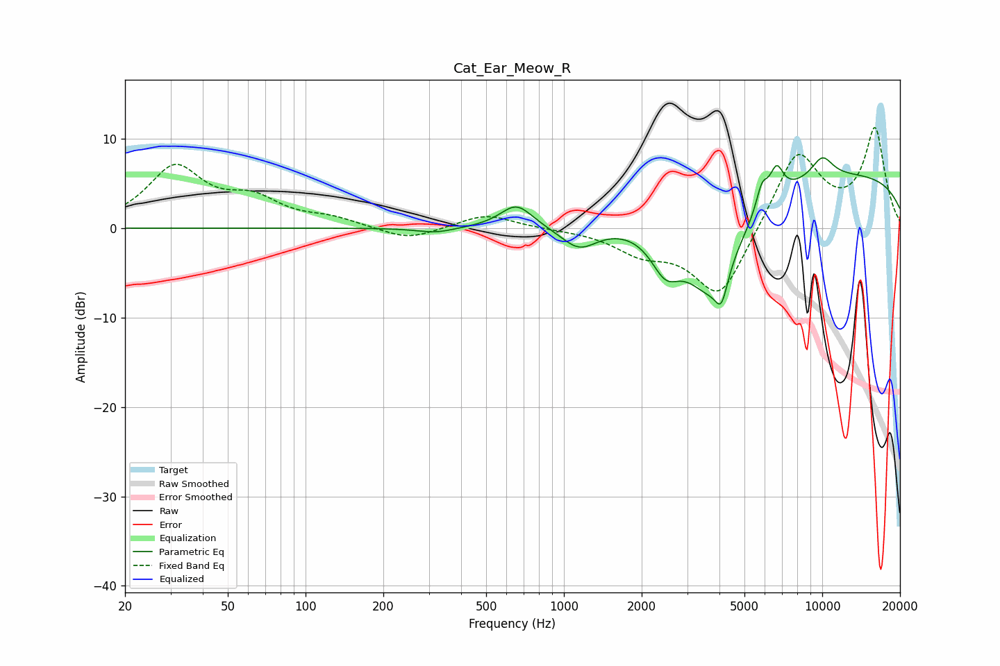

# Cat_Ear_Meow_R
See [usage instructions](https://github.com/jaakkopasanen/AutoEq#usage) for more options and info.

### Parametric EQs
Apply preamp of -8.0 dB when using parametric equalizer.

|   # | Type    |   Fc (Hz) |    Q |   Gain (dB) |
|-----|---------|-----------|------|-------------|
|   1 | Peaking |       319 | 1.89 |        -0.6 |
|   2 | Peaking |       655 | 2.27 |         2.6 |
|   3 | Peaking |      1146 | 1.95 |        -2.7 |
|   4 | Peaking |      2469 | 2.51 |        -3.9 |
|   5 | Peaking |      3693 | 1.17 |       -10.6 |
|   6 | Peaking |      4073 | 5.79 |        -3.4 |
|   7 | Peaking |      5842 | 6    |         2.7 |
|   8 | Peaking |      6653 | 5.03 |         3.4 |
|   9 | Peaking |     10000 | 0.18 |         6.3 |
|  10 | Peaking |     10000 | 2.79 |         2.4 |

### Fixed Band EQs
When using fixed band (also called graphic) equalizer, apply preamp of **-11.3 dB** (if available) and set gains manually with these parameters.

|   # | Type    |   Fc (Hz) |    Q |   Gain (dB) |
|-----|---------|-----------|------|-------------|
|   1 | Peaking |        31 | 1.41 |         6.6 |
|   2 | Peaking |        62 | 1.41 |         2.7 |
|   3 | Peaking |       125 | 1.41 |         0.9 |
|   4 | Peaking |       250 | 1.41 |        -1.4 |
|   5 | Peaking |       500 | 1.41 |         1.6 |
|   6 | Peaking |      1000 | 1.41 |        -0.1 |
|   7 | Peaking |      2000 | 1.41 |        -2.3 |
|   8 | Peaking |      4000 | 1.41 |        -8.1 |
|   9 | Peaking |      8000 | 1.41 |         8.8 |
|  10 | Peaking |     16000 | 1.41 |        10.9 |

### Graphs

