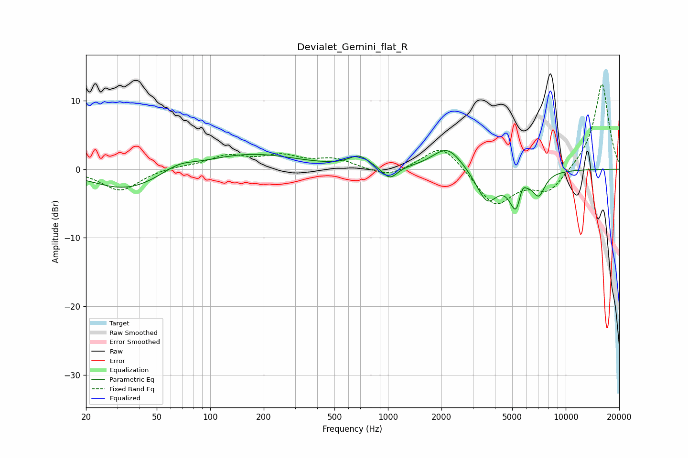

# Devialet_Gemini_flat_R
See [usage instructions](https://github.com/jaakkopasanen/AutoEq#usage) for more options and info.

### Parametric EQs
Apply preamp of -2.8 dB when using parametric equalizer.

|   # | Type    |   Fc (Hz) |    Q |   Gain (dB) |
|-----|---------|-----------|------|-------------|
|   1 | Peaking |        34 | 0.75 |        -3.1 |
|   2 | Peaking |        66 | 1.66 |         1.1 |
|   3 | Peaking |       166 | 0.54 |         2.3 |
|   4 | Peaking |       687 | 2.53 |         1.6 |
|   5 | Peaking |      1023 | 3.36 |        -1.9 |
|   6 | Peaking |      2160 | 1.7  |         3.4 |
|   7 | Peaking |      3608 | 2.31 |        -4.7 |
|   8 | Peaking |      5318 | 3.61 |        -6.1 |
|   9 | Peaking |      5659 | 6    |         2.8 |
|  10 | Peaking |      7067 | 3.97 |        -3   |

### Fixed Band EQs
When using fixed band (also called graphic) equalizer, apply preamp of **-12.5 dB** (if available) and set gains manually with these parameters.

|   # | Type    |   Fc (Hz) |    Q |   Gain (dB) |
|-----|---------|-----------|------|-------------|
|   1 | Peaking |        31 | 1.41 |        -3.2 |
|   2 | Peaking |        62 | 1.41 |         0.4 |
|   3 | Peaking |       125 | 1.41 |         1.8 |
|   4 | Peaking |       250 | 1.41 |         1.7 |
|   5 | Peaking |       500 | 1.41 |         1.4 |
|   6 | Peaking |      1000 | 1.41 |        -1.3 |
|   7 | Peaking |      2000 | 1.41 |         3.9 |
|   8 | Peaking |      4000 | 1.41 |        -5.3 |
|   9 | Peaking |      8000 | 1.41 |        -3.3 |
|  10 | Peaking |     16000 | 1.41 |        12.7 |

### Graphs

