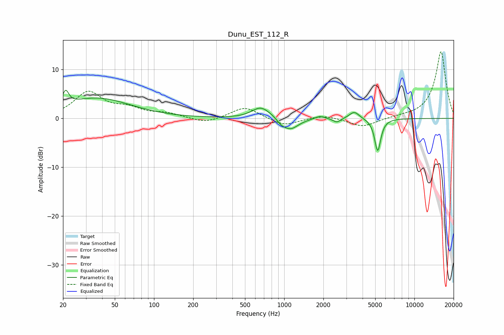

# Dunu_EST_112_R
See [usage instructions](https://github.com/jaakkopasanen/AutoEq#usage) for more options and info.

### Parametric EQs
Apply preamp of -5.8 dB when using parametric equalizer.

|   # | Type    |   Fc (Hz) |    Q |   Gain (dB) |
|-----|---------|-----------|------|-------------|
|   1 | Peaking |        21 | 5.94 |         2.9 |
|   2 | Peaking |        37 | 0.55 |         4.1 |
|   3 | Peaking |       654 | 2.13 |         2   |
|   4 | Peaking |       763 | 1.82 |         0.5 |
|   5 | Peaking |       946 | 4.53 |        -0.7 |
|   6 | Peaking |      1112 | 2.27 |        -2.4 |
|   7 | Peaking |      1874 | 3.62 |         0.7 |
|   8 | Peaking |      2541 | 4.79 |        -0.9 |
|   9 | Peaking |      3455 | 3.71 |         1.5 |
|  10 | Peaking |      5224 | 6    |        -6.7 |

### Fixed Band EQs
When using fixed band (also called graphic) equalizer, apply preamp of **-13.7 dB** (if available) and set gains manually with these parameters.

|   # | Type    |   Fc (Hz) |    Q |   Gain (dB) |
|-----|---------|-----------|------|-------------|
|   1 | Peaking |        31 | 1.41 |         5.2 |
|   2 | Peaking |        62 | 1.41 |         1.7 |
|   3 | Peaking |       125 | 1.41 |         0.9 |
|   4 | Peaking |       250 | 1.41 |        -1.1 |
|   5 | Peaking |       500 | 1.41 |         2.4 |
|   6 | Peaking |      1000 | 1.41 |        -1.6 |
|   7 | Peaking |      2000 | 1.41 |         0.8 |
|   8 | Peaking |      4000 | 1.41 |        -1.8 |
|   9 | Peaking |      8000 | 1.41 |         0.2 |
|  10 | Peaking |     16000 | 1.41 |        13.7 |

### Graphs

