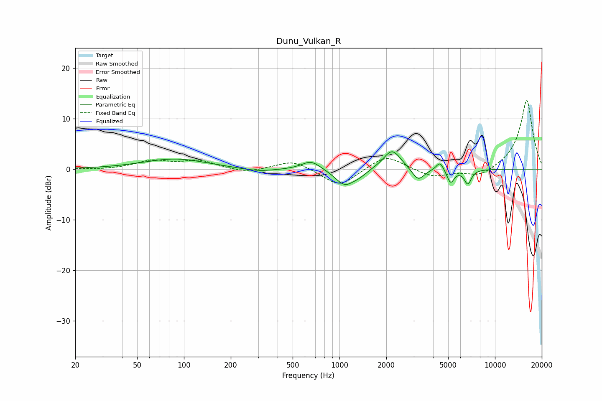

# Dunu_Vulkan_R
See [usage instructions](https://github.com/jaakkopasanen/AutoEq#usage) for more options and info.

### Parametric EQs
Apply preamp of -3.5 dB when using parametric equalizer.

|   # | Type    |   Fc (Hz) |    Q |   Gain (dB) |
|-----|---------|-----------|------|-------------|
|   1 | Peaking |        88 | 0.69 |         2   |
|   2 | Peaking |       300 | 1.27 |        -0.6 |
|   3 | Peaking |       657 | 2.35 |         1.8 |
|   4 | Peaking |      1081 | 2.27 |        -3.2 |
|   5 | Peaking |      1347 | 2.92 |        -0.8 |
|   6 | Peaking |      2179 | 2.49 |         4   |
|   7 | Peaking |      3205 | 3.64 |        -2.5 |
|   8 | Peaking |      4430 | 5.95 |         1.8 |
|   9 | Peaking |      5184 | 6    |        -2.7 |
|  10 | Peaking |      6687 | 6    |        -2.8 |

### Fixed Band EQs
When using fixed band (also called graphic) equalizer, apply preamp of **-13.7 dB** (if available) and set gains manually with these parameters.

|   # | Type    |   Fc (Hz) |    Q |   Gain (dB) |
|-----|---------|-----------|------|-------------|
|   1 | Peaking |        31 | 1.41 |        -0.1 |
|   2 | Peaking |        62 | 1.41 |         1.5 |
|   3 | Peaking |       125 | 1.41 |         1.6 |
|   4 | Peaking |       250 | 1.41 |        -0.8 |
|   5 | Peaking |       500 | 1.41 |         1.8 |
|   6 | Peaking |      1000 | 1.41 |        -3.6 |
|   7 | Peaking |      2000 | 1.41 |         2.9 |
|   8 | Peaking |      4000 | 1.41 |        -1.6 |
|   9 | Peaking |      8000 | 1.41 |        -1.6 |
|  10 | Peaking |     16000 | 1.41 |        13.7 |

### Graphs

