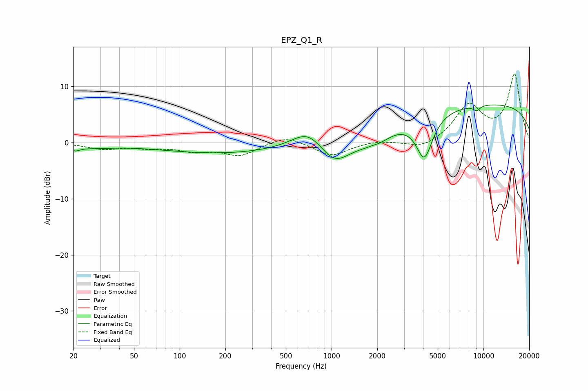

# EPZ_Q1_R
See [usage instructions](https://github.com/jaakkopasanen/AutoEq#usage) for more options and info.

### Parametric EQs
Apply preamp of -6.8 dB when using parametric equalizer.

|   # | Type    |   Fc (Hz) |    Q |   Gain (dB) |
|-----|---------|-----------|------|-------------|
|   1 | Peaking |        20 | 4.12 |        -0.8 |
|   2 | Peaking |        27 | 1.06 |        -0.7 |
|   3 | Peaking |       189 | 0.34 |        -1.9 |
|   4 | Peaking |       703 | 1.35 |         3.3 |
|   5 | Peaking |      1048 | 1.35 |        -4.5 |
|   6 | Peaking |      1838 | 3.31 |         0.4 |
|   7 | Peaking |      1910 | 1.39 |        -2.5 |
|   8 | Peaking |      4081 | 2.55 |        -7.7 |
|   9 | Peaking |      9022 | 5.67 |        -0.9 |
|  10 | Peaking |     10000 | 0.18 |         7   |

### Fixed Band EQs
When using fixed band (also called graphic) equalizer, apply preamp of **-12.3 dB** (if available) and set gains manually with these parameters.

|   # | Type    |   Fc (Hz) |    Q |   Gain (dB) |
|-----|---------|-----------|------|-------------|
|   1 | Peaking |        31 | 1.41 |        -1   |
|   2 | Peaking |        62 | 1.41 |        -0.8 |
|   3 | Peaking |       125 | 1.41 |        -1.3 |
|   4 | Peaking |       250 | 1.41 |        -2.2 |
|   5 | Peaking |       500 | 1.41 |         1.4 |
|   6 | Peaking |      1000 | 1.41 |        -2.4 |
|   7 | Peaking |      2000 | 1.41 |         0.4 |
|   8 | Peaking |      4000 | 1.41 |        -1.3 |
|   9 | Peaking |      8000 | 1.41 |         6.4 |
|  10 | Peaking |     16000 | 1.41 |        12   |

### Graphs

