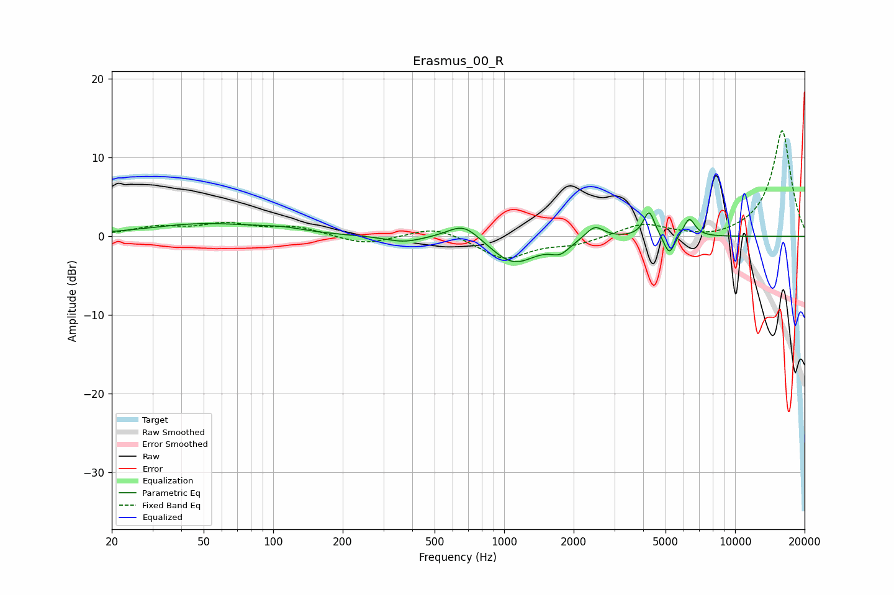

# Erasmus_00_R
See [usage instructions](https://github.com/jaakkopasanen/AutoEq#usage) for more options and info.

### Parametric EQs
Apply preamp of -3.1 dB when using parametric equalizer.

|   # | Type    |   Fc (Hz) |    Q |   Gain (dB) |
|-----|---------|-----------|------|-------------|
|   1 | Peaking |        50 | 0.58 |         1.6 |
|   2 | Peaking |       110 | 1.48 |         0.5 |
|   3 | Peaking |       368 | 1.8  |        -0.8 |
|   4 | Peaking |       670 | 2.01 |         2.2 |
|   5 | Peaking |      1099 | 1.43 |        -3.5 |
|   6 | Peaking |      1752 | 3.41 |        -1.4 |
|   7 | Peaking |      2468 | 3.68 |         1.7 |
|   8 | Peaking |      4244 | 5.87 |         3.3 |
|   9 | Peaking |      5187 | 6    |        -2.6 |
|  10 | Peaking |      6334 | 5.47 |         2.4 |

### Fixed Band EQs
When using fixed band (also called graphic) equalizer, apply preamp of **-13.5 dB** (if available) and set gains manually with these parameters.

|   # | Type    |   Fc (Hz) |    Q |   Gain (dB) |
|-----|---------|-----------|------|-------------|
|   1 | Peaking |        31 | 1.41 |         1.1 |
|   2 | Peaking |        62 | 1.41 |         1.4 |
|   3 | Peaking |       125 | 1.41 |         1.1 |
|   4 | Peaking |       250 | 1.41 |        -1.1 |
|   5 | Peaking |       500 | 1.41 |         1.4 |
|   6 | Peaking |      1000 | 1.41 |        -2.9 |
|   7 | Peaking |      2000 | 1.41 |        -1   |
|   8 | Peaking |      4000 | 1.41 |         1.6 |
|   9 | Peaking |      8000 | 1.41 |        -0.5 |
|  10 | Peaking |     16000 | 1.41 |        13.5 |

### Graphs

