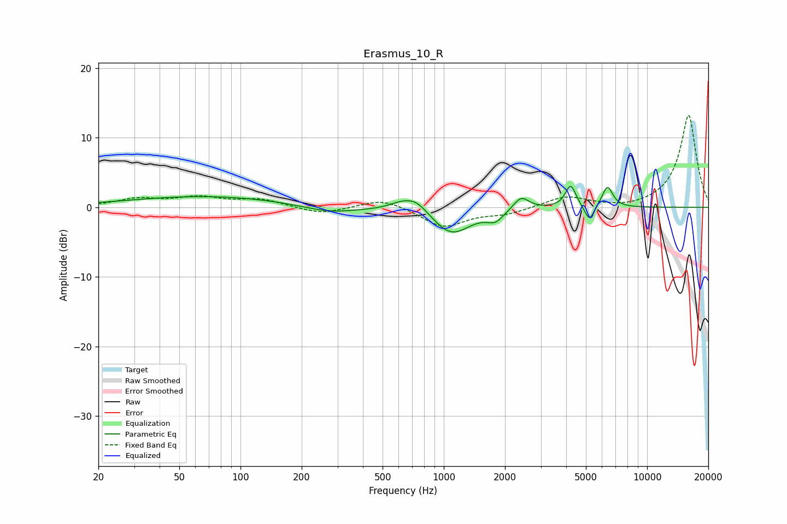

# Erasmus_10_R
See [usage instructions](https://github.com/jaakkopasanen/AutoEq#usage) for more options and info.

### Parametric EQs
Apply preamp of -3.1 dB when using parametric equalizer.

|   # | Type    |   Fc (Hz) |    Q |   Gain (dB) |
|-----|---------|-----------|------|-------------|
|   1 | Peaking |        68 | 0.36 |         1.6 |
|   2 | Peaking |       274 | 1.03 |        -1   |
|   3 | Peaking |       602 | 2.66 |         0.6 |
|   4 | Peaking |       727 | 2.26 |         2   |
|   5 | Peaking |      1089 | 1.49 |        -3.9 |
|   6 | Peaking |      1794 | 3.48 |        -1.4 |
|   7 | Peaking |      2403 | 3.7  |         1.9 |
|   8 | Peaking |      4208 | 5.45 |         3.2 |
|   9 | Peaking |      5207 | 6    |        -2.3 |
|  10 | Peaking |      6383 | 5.24 |         3   |

### Fixed Band EQs
When using fixed band (also called graphic) equalizer, apply preamp of **-13.3 dB** (if available) and set gains manually with these parameters.

|   # | Type    |   Fc (Hz) |    Q |   Gain (dB) |
|-----|---------|-----------|------|-------------|
|   1 | Peaking |        31 | 1.41 |         1.1 |
|   2 | Peaking |        62 | 1.41 |         1.3 |
|   3 | Peaking |       125 | 1.41 |         1.1 |
|   4 | Peaking |       250 | 1.41 |        -1   |
|   5 | Peaking |       500 | 1.41 |         1.4 |
|   6 | Peaking |      1000 | 1.41 |        -2.8 |
|   7 | Peaking |      2000 | 1.41 |        -0.9 |
|   8 | Peaking |      4000 | 1.41 |         1.6 |
|   9 | Peaking |      8000 | 1.41 |        -0.3 |
|  10 | Peaking |     16000 | 1.41 |        13.3 |

### Graphs

