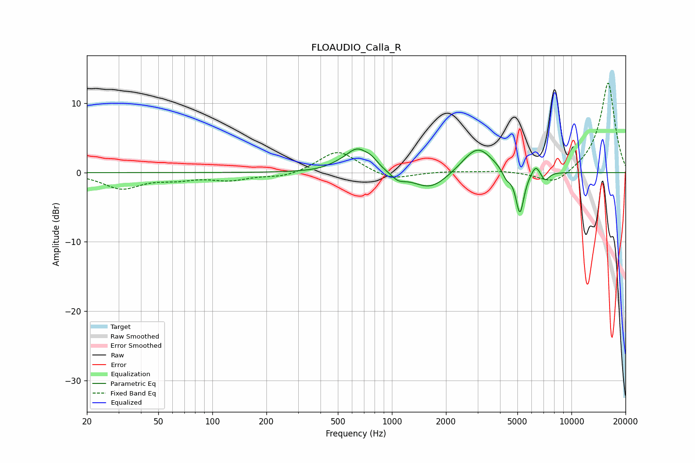

# FLOAUDIO_Calla_R
See [usage instructions](https://github.com/jaakkopasanen/AutoEq#usage) for more options and info.

### Parametric EQs
Apply preamp of -3.5 dB when using parametric equalizer.

|   # | Type    |   Fc (Hz) |    Q |   Gain (dB) |
|-----|---------|-----------|------|-------------|
|   1 | Peaking |       491 | 2.45 |         0.3 |
|   2 | Peaking |       642 | 2.1  |         3.3 |
|   3 | Peaking |       773 | 4.07 |         0.8 |
|   4 | Peaking |      1084 | 3.63 |        -1   |
|   5 | Peaking |      1642 | 1.43 |        -2.6 |
|   6 | Peaking |      2996 | 1.68 |         4   |
|   7 | Peaking |      4343 | 6    |        -1.3 |
|   8 | Peaking |      5161 | 5.99 |        -6.3 |
|   9 | Peaking |      6330 | 5.98 |         1.4 |
|  10 | Peaking |      7127 | 6    |        -1.3 |

### Fixed Band EQs
When using fixed band (also called graphic) equalizer, apply preamp of **-13.0 dB** (if available) and set gains manually with these parameters.

|   # | Type    |   Fc (Hz) |    Q |   Gain (dB) |
|-----|---------|-----------|------|-------------|
|   1 | Peaking |        31 | 1.41 |        -2.2 |
|   2 | Peaking |        62 | 1.41 |        -0.8 |
|   3 | Peaking |       125 | 1.41 |        -1   |
|   4 | Peaking |       250 | 1.41 |        -0.7 |
|   5 | Peaking |       500 | 1.41 |         3.3 |
|   6 | Peaking |      1000 | 1.41 |        -1.2 |
|   7 | Peaking |      2000 | 1.41 |         0.2 |
|   8 | Peaking |      4000 | 1.41 |         0.2 |
|   9 | Peaking |      8000 | 1.41 |        -2   |
|  10 | Peaking |     16000 | 1.41 |        13.1 |

### Graphs

