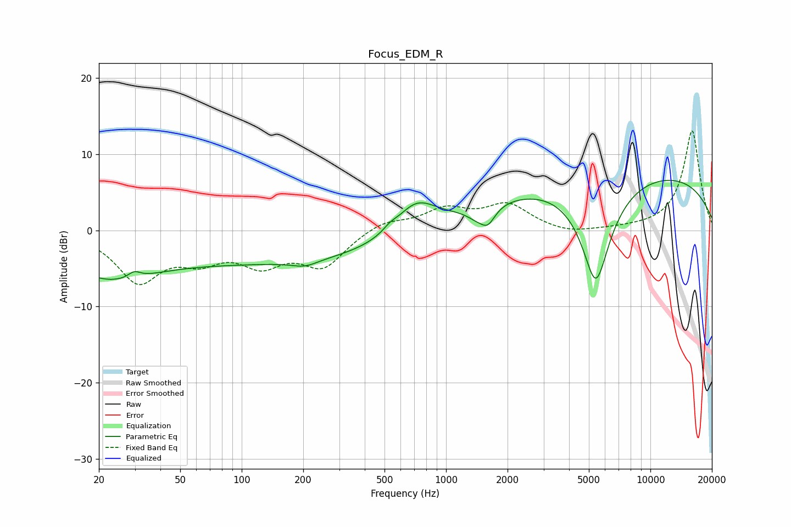

# Focus_EDM_R
See [usage instructions](https://github.com/jaakkopasanen/AutoEq#usage) for more options and info.

### Parametric EQs
Apply preamp of -6.7 dB when using parametric equalizer.

|   # | Type    |   Fc (Hz) |    Q |   Gain (dB) |
|-----|---------|-----------|------|-------------|
|   1 | Peaking |        22 | 0.64 |        -5.2 |
|   2 | Peaking |        30 | 4.76 |         0.9 |
|   3 | Peaking |       154 | 0.21 |        -4.2 |
|   4 | Peaking |       204 | 2.24 |        -0.8 |
|   5 | Peaking |       531 | 4.46 |         0.5 |
|   6 | Peaking |       713 | 1.38 |         4.3 |
|   7 | Peaking |      1421 | 2.77 |        -1.3 |
|   8 | Peaking |      1605 | 4.02 |        -2   |
|   9 | Peaking |      5408 | 1.81 |       -14.1 |
|  10 | Peaking |      7571 | 0.18 |         8   |

### Fixed Band EQs
When using fixed band (also called graphic) equalizer, apply preamp of **-13.2 dB** (if available) and set gains manually with these parameters.

|   # | Type    |   Fc (Hz) |    Q |   Gain (dB) |
|-----|---------|-----------|------|-------------|
|   1 | Peaking |        31 | 1.41 |        -6.4 |
|   2 | Peaking |        62 | 1.41 |        -3   |
|   3 | Peaking |       125 | 1.41 |        -3.8 |
|   4 | Peaking |       250 | 1.41 |        -4.5 |
|   5 | Peaking |       500 | 1.41 |         1.3 |
|   6 | Peaking |      1000 | 1.41 |         2.6 |
|   7 | Peaking |      2000 | 1.41 |         3.2 |
|   8 | Peaking |      4000 | 1.41 |        -0.6 |
|   9 | Peaking |      8000 | 1.41 |         0.1 |
|  10 | Peaking |     16000 | 1.41 |        13.1 |

### Graphs

