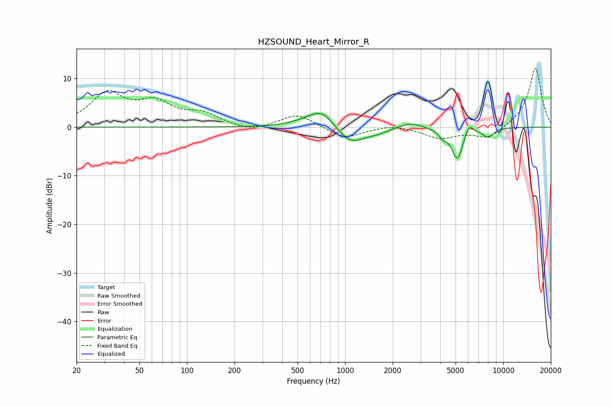

# HZSOUND_Heart_Mirror_R
See [usage instructions](https://github.com/jaakkopasanen/AutoEq#usage) for more options and info.

### Parametric EQs
Apply preamp of -2.9 dB when using parametric equalizer.

|   # | Type    |   Fc (Hz) |    Q |   Gain (dB) |
|-----|---------|-----------|------|-------------|
|   1 | Peaking |       555 | 1.5  |         0.8 |
|   2 | Peaking |       715 | 1.84 |         3.4 |
|   3 | Peaking |      1071 | 1.39 |        -1   |
|   4 | Peaking |      1090 | 1.74 |        -2.6 |
|   5 | Peaking |      1587 | 2.28 |        -0.8 |
|   6 | Peaking |      2603 | 2.14 |         1.2 |
|   7 | Peaking |      4154 | 5.72 |        -1.3 |
|   8 | Peaking |      5131 | 3.91 |        -6.5 |
|   9 | Peaking |      6078 | 5.49 |         2.1 |
|  10 | Peaking |      8011 | 3.77 |        -1.9 |

### Fixed Band EQs
When using fixed band (also called graphic) equalizer, apply preamp of **-12.2 dB** (if available) and set gains manually with these parameters.

|   # | Type    |   Fc (Hz) |    Q |   Gain (dB) |
|-----|---------|-----------|------|-------------|
|   1 | Peaking |        31 | 1.41 |         6.6 |
|   2 | Peaking |        62 | 1.41 |         4.4 |
|   3 | Peaking |       125 | 1.41 |         2.4 |
|   4 | Peaking |       250 | 1.41 |        -1.1 |
|   5 | Peaking |       500 | 1.41 |         2.7 |
|   6 | Peaking |      1000 | 1.41 |        -2.4 |
|   7 | Peaking |      2000 | 1.41 |         0.6 |
|   8 | Peaking |      4000 | 1.41 |        -2.2 |
|   9 | Peaking |      8000 | 1.41 |        -2.4 |
|  10 | Peaking |     16000 | 1.41 |        12.3 |

### Graphs

